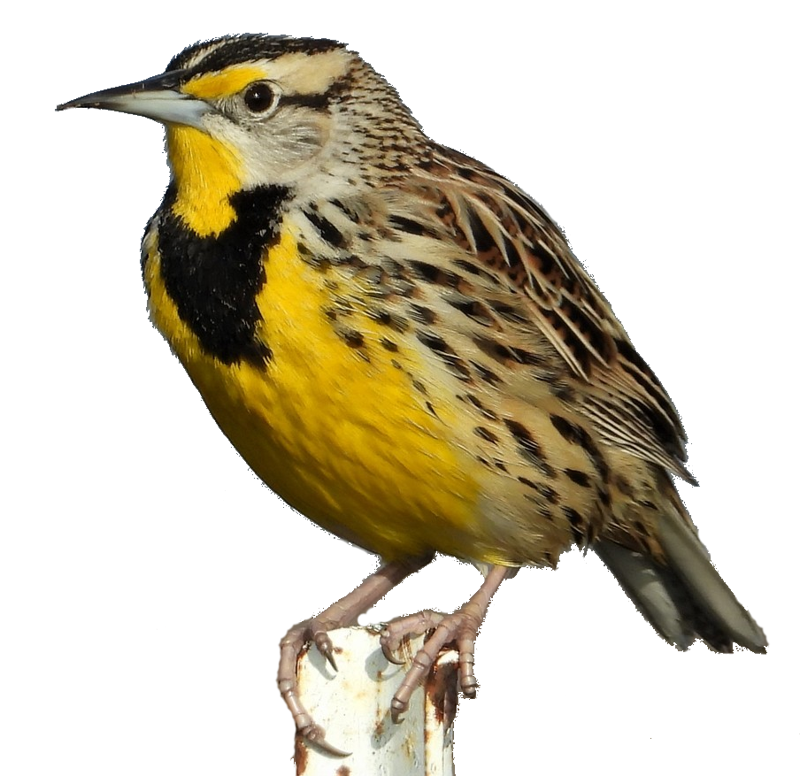

# Ed-Fi-Meadowlark

The Meadowlark code and releases provide a deployable, distributable,
proof-of-concept for a cloud-native (i.e., built on cloud services)
implementation of the Ed-Fi API surface. It therefore replicates the data
collection capabilities of the Ed-Fi ODS/API, but does not replicate the
database structure and storage of the ODS/API.

:no_entry: Warning :no_entry:: this is not for use in production or
production-like settings.

## Getting Started

* [Deployment on AWS](docs/DEPLOYMENT.md)
* [Running on Localhost](docs/LOCALHOST.md)
* [Developer getting started notes](docs/)
  * [Additional technical details](docs/TECHNICAL.md)

## Legal Information

Copyright (c) 2022 Ed-Fi Alliance, LLC and contributors.

Licensed under the [Apache License, Version 2.0](LICENSE) (the "License").

Unless required by applicable law or agreed to in writing, software distributed
under the License is distributed on an "AS IS" BASIS, WITHOUT WARRANTIES OR
CONDITIONS OF ANY KIND, either express or implied. See the License for the
specific language governing permissions and limitations under the License.

See [NOTICES](NOTICES.md) for additional copyright and license notifications.

Meadowlark image: Copyright &copy; Joel Chamberlain, [some rights
reserved](http://creativecommons.org/licenses/by-nc/4.0/).
[Original source](https://www.inaturalist.org/observations/38032376).
