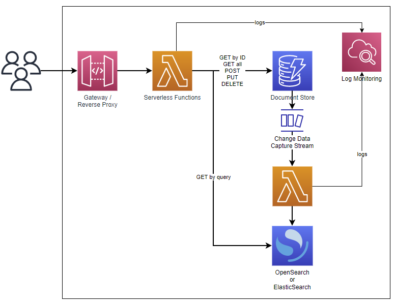
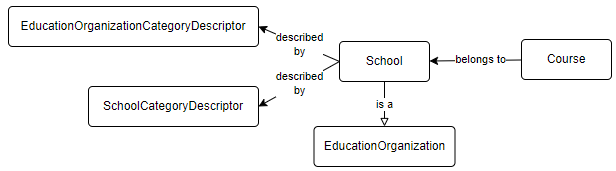

# Meadowlark Architecture

# Introduction

Project Meadowlark is a proof-of-concept implementation of the Ed-Fi API Specification, currently supporting Data Standard 3.3b, built on managed services provided by AWS. This document describes the system architecture, including: managed service infrastructure and flow; frameworks used in programming the solution; and notes about potential future direction.

*→ [More information on  Meadowlark](../project-meadowlark-documentation.md)*

## Cloud Managed Services

The big three cloud providers (Amazon, Google, Microsoft) all provide similar managed services that could have been used to build this application. The choice of Amazon Web Services (AWS) is not an endorsement of Amazon *per se*. Rather, the development team needed to commit to one service in order to remain focused on delivering a usable proof-of-concept without over-engineering up-front. Development of a full-fledged *product*  based on Meadowlark would require additional effort to ensure that the core software can easily be used on any cloud platform or on-premises.

→ *[More information on provider parity](../project-meadowlark-documentation/meadowlark-provider-parity-analysis.md)*

## Infrastructure

The following diagram illustrates the managed service infrastructure utilized by Meadowlark.



What does each of these services provide?

*   An **API Gateway** is a front-end web server that acts as a proxy back to the separate serverless functions. With the help of the API Gateway, client applications need know only a single base URL, and the different resource endpoints can opaquely point back to different back-end services or functions.
*   **Serverless Functions** are small, purpose-built, serverless runtime hosts for application code. In the AWS ecosystem, Lambda Functions serve this purpose. In the Meadowlark solution, there are ten different Lambda Functions that handle inbound requests from the API Gateway. For simplicity, only a single icon represents all ten in the diagram above.
*   **Database** services are provisioned with a NoSQL document store. For ease of use, the Meadowlark project used Amazon's **DynamoDB** . One of the powerful features of many NoSQL databases is **Change Data Capture (CDC) Streaming**: each change to an item stored in the database creates an event on a stream. Another serverless function detects this event to provide post-processing for saving into another datastore.
    *   

         This CDC triggering of a serverless function is an incredibly powerful extension point for adding downstream post-processing of any kind. Examples: generate notifications, initiate second-level business rule validation.
    *   

         *Any serious attempt to turn Meadowlark into a full-fledged project would require moving away from DynamoDB to an open source document storage database, such as MongoDB, Cassandra, or ScyllaDB.*
*   **OpenSearch** is an open source NoSQL database originally based on ElasticSearch, providing high-performance indexing and querying capabilities. All of the "GET by query" (aka "GET by example") client requests are served by this powerful search engine.
*   **Log Monitoring** supports centralized collection, monitoring, and alerting on logs. In the Meadowlark implementation on AWS, **CloudWatch** provides that functionality.

### Utilizing Multiple Databases

In traditional application development, including the Ed-Fi ODS/API Platform, all Create-Read-Update-Delete (CRUD) operations are served by a single database instance. Project Meadowlark has instead adopted the strategy of choosing database engines that are a good fit-to-purpose. "NoSQL"  databases are a good fit for online transaction processing (OLTP) because they enable storage of the raw API payloads (JSON) directly in the database. This improves both the write speed and the speed of retrieving a single object from the database, since there are no joins to perform between different tables. In the current implementation, AWS's native and proprietary DynamoDB was selected as the primary transaction database for the simple reason that its architecture was interesting to explore. There are other document and key-value storage systems that could easily be used instead of DynamoDB.

A key difference between this document storage approach, compared to relational database modeling, comes in the form of searchability. Many key-value and document databases have the ability to add "secondary indexes" that can help find individual items by some global criteria. But these are limited and very different than the indexes found in a relational database, which can be tuned to identify items based on any column. In other words, when storing an entire document, most key-value and document databases fare poorly when trying to search by query terms (e.g. "get all students with last name Doe"). 

This is where OpenSearch shines. Based on ElasticSearch, OpenSearch is also a NoSQL document store. The key difference is that it indexes everything in the document, and has a powerful search engine across the indexes. OpenSearch is not designed to be a robust solution for high performance write operations, so it does not make sense to write directly to it.

To streamline the Meadowlark API functionality, that code only writes to one database (DynamoDB). It then use's that database's *change data capture* trigger or stream to push new data out to another serverless function. That next function writes data to OpenSearch in a completely asynchronous / non-blocking process, and naturally deletes removed objects from OpenSearch.

> [!TIP]
> Early on, the development team also experimented with writing the item out to blob storage (S3) in addition to OpenSearch. With JSON objects stored in S3, it was incredibly easy to build a simple analytics dashboard in Amazon QuickSight, with Amazon Athena sitting in the middle as the query engine.
> The S3 work was removed for expediency after an upgrade to the AWS SDK broke the code, and it may be restored in the future. Additionally, it may be useful to explore having the "GET by ID" requests served from blob storage instead of from the transaction database to take advantage of lower-cost reads; this can also be combined with CDN caching (for example with descriptors) to further improve performance and potentially lower the per-transaction cost.

### Eventual Consistency

Highly scalable databases such as DynamoDB and Cassandra store multiple copies of the data for resiliency and high availability, and only one of these copies receives the initial write operation. The service guarantees that all other copies will eventually come up to date with that initial write operation: the data will *eventually be consistent*. The tradeoff is in favor of connection reliability: queries are not blocked by write operations.[](https://docs.aws.amazon.com/amazondynamodb/latest/developerguide/HowItWorks.ReadConsistency.html)

Many people find this disturbing at first, if they are used to thinking about transaction locking in relational databases. But the reality is less scary than it sounds.

[Amazon states](https://docs.aws.amazon.com/amazondynamodb/latest/developerguide/HowItWorks.ReadConsistency.html) that it typically takes "one second or less" to bring all copies up to date. Let's compare the outcomes of the following three scenarios:

| Time | Scenario 1 | Scenario 2 | Scenario 3 |
| --- | --- | --- | --- |
| 10:01:01.000 AM | **Client A reads a record** | Client B writes an update to that record | Client B writes an update to that record |
| 10:01:01.500 AM (half second) | Client B writes an update to that record | **Client A reads a record** | All DynamoDB copies are up-to-date |
| 10:01:02.000 AM (full second) | All DynamoDB copies are up-to-date | All DynamoDB copies are up-to-date | **Client A reads a record** |
| *Status* | *Client A has stale data* | *Client A* might *have stale data* | *Client A has current data* |

In Scenario 1, Client A receives stale data because they requested it *half a second* before Client B writes an update. *And this is no different than in a relational database*.

In Scenario 2, the Client B writes an update *half a second* before Client A sends a read. Client A might coincidentally be assigned to read from the first database node that received the record, or it might read from a node that is lagging by half a second. Thus it *might* get stale data, though this is not guaranteed.

Finally in Scenario 3, Client A asks for a record a full second after Client B had written an update, and Client A is *nearly* guaranteed to get the current (not stale) data. *Again, same as with a standard relational database*.

The practical difference between the guaranteed consistency of a relational database and the eventual consistency of a distributed database like DynamoDB is thus more a matter of happenstance than anything else. In either case, if Client A reads from the system a millisecond before Client B writes, then Client A will have stale data. If Client A reads *after*  Client B writes, then the window of time for getting stale data goes up to perhaps a second. *But if they do get stale data, they will never know that they weren't in scenario 1.*

Eventual consistency is likely "good enough." But it does deserve further community consideration before using it in a production system.

### Data Duplication

For many people, this process of copying data into two storage locations (DynamoDB and OpenSearch) may seem very strange. Programmers are taught to "write once", avoiding the costs of storing and maintaining duplicate data.

From the storage perspective, there is a false assumption here: when a relational database table has indexes, you are already storing duplicate copies of the data. With paired DynamoDB and OpenSearch, that hidden truth simply comes to the surface. Furthermore, the cost of storage is generally much lower than computation: so one should optimize for compute time more than for storage volume (within reason). OpenSearch is computationally powerful for indexed searches, whereas DynamoDB is computationally expensive if you try a full-table scan to look for an object via *ad hoc* query.

There is also an eventual consistency challenge here, one that is more significant than with DynamoDB by itself: there is a greater probability of an error in the CDC stream → Lamba function → OpenSearch write process than in the DynamoDB node synchronization process. This too deserves further scrutiny and operational testing, after changing to a different primary transactional database.

## Programming Framework

### Application Code

The application code has been written in TypeScript running on Node.js, which are [popular tools](https://insights.stackoverflow.com/survey/2021#technology-most-popular-technologies) for modern web application development. Using TypeScript/JavaScript also gives us the advantage of leveraging MetaEd, as discussed in the next section.

The code uses the latest software development kit from Amazon, AWS SDK 3, to mediate interactions with AWS services: receiving requests from API Gateway, writing to DynamoDB, and writing to OpenSearch.

As a proof-of-concept, the development team did not spend as much time writing unit tests as would be done in production-ready code. That said, there are unit tests to cover approximately 60% of the application code (as of initial release), with the biggest gap being in the database persistence code, which is naturally harder to unit test. 

### MetaEd

The Ed-Fi Data Standard is defined in code through [MetaEd files](https://edfi.atlassian.net/wiki/display/EDFITOOLS/MetaEd+IDE). The MetaEd application has a *build*  tool that generates JSON and SQL files that the ODS/API Platform leverages for auto-generating  significant portions of the Ed-Fi ODS/API Platform. By leveraging that same MetaEd code base, Meadowlark is able to construct an entire API surface at runtime without having to generate source code files. And thanks to the (essentially) schema-less nature of the NoSQL databases, there is no need for resource-specific mapping code when performing operations on items in the databases.

Because it translates MetaEd files directly into an API surface, Meadowlark does not have any Data Standard specific code. No code changes are needed to support a newer (or older) Data Standard, although migrating data from one standard to another would require an external process.

### Deployment

The [Serverless Framework](https://www.serverless.com/framework/docs) provides all of the heavy lifting for packaging the source code into Lambda functions, provisioning required resources in AWS, and setting up the necessary user permissions on AWS objects. The Serverless Framework also serves as an abstraction layer that should ease the transition from one cloud provider platform to another. Even where details need to change from one provider to the next, at least Serverless gives a common YML-based configuration language, instead of having to learn the nuances of each provider's native domain-specific deployment language (AWS Cloud Formation, Azure Resource Manager, Google Deployment Manager). 

### Table Design

*This table design is DynamoDB-specific, though it may be appropriate in similar database systems such as Cassandra. If moving to a document store such as MongoDB, Firebase, or CouchbaseDB, then this design would need to be revisited.*

Meadowlark uses the [single-table design](https://aws.amazon.com/blogs/compute/creating-a-single-table-design-with-amazon-dynamodb/) approach for storage in DynamoDB, with the following structure:

| Column Name | Purpose |
| --- | --- |
| pk​ | Hash key (aka partition key) - one half of the primary key​. |
| sk  | Range key (aka sort key) - the other half of the primary key |
| naturalKey | Plain text version of the natural key |
| info | Contains the JSON document for a resource |

There are also a couple of experimental columns and secondary indexes for exploring relationship-based authorization. 

Meadowlark creates a unique resource ID by calculating a  [SHA-3](https://en.wikipedia.org/wiki/SHA-3) (cShake 128) hash value from the natural key. This value is stored as the sort key, `sk` . The partition key, `pk` , contains entity type information: schema, model version, and domain entity name.

> [!TIP]
> In DynamoDB, an "item" is analogous to a "record" in a relational database. Thus a single object being stored in a DynamoDB table is stored as "an item".

### Referential Integrity and Item Types

An important feature of an Ed-Fi API is the ability to enforce referential integrity, rejecting modification requests where the modified item refers to another item that does not actually exist. An Ed-Fi API also rejects attempts to delete items that are referred to by other items.

Most NoSQL databases do not support referential integrity, whereas the ODS/API Platform leverages referential integrity checking built into the SQL database. Therefore Meadowlark had to develop its own system for referential integrity checks, in application code. In short, Meadowlark transactionally writes extra items to the transactional database with pointers to the referenced items. These items are trivial to look up.

>[!WARNING]

 > Due to eventual consistency, there is a small but real possibility of a referential integrity check *miss* *.* To what extent does this matter?  Another question for the community to explore.

To illustrate: assume that a Meadowlark instance already has descriptors loaded, and an API client wants to load a School and a Course that belongs to that school. Adding excitement to the scenario: in the Ed-Fi Data Model, a School *is an* Education Organization (extends / inherits).



Below is the successful POST request to create the new school:

```none title="Request"
POST http://aws-created-url/stage-name/v3.3b/ed-fi/schools

{
    "schoolId": 122,
    "nameOfInstitution": "A School",
    "educationOrganizationCategories" : [
        {
            "educationOrganizationCategoryDescriptor": "uri://ed-fi.org/EducationOrganizationCategoryDescriptor#Other"
        }
    ],
    "schoolCategories": [
        {
             "schoolCategoryDescriptor": "uri://ed-fi.org/SchoolCategoryDescriptor#All Levels"
        }
    ],
    "gradeLevels": []
}
```

```none title="Response"
HTTP/1.1 201 Created
x-metaed-project-name: Ed-Fi
x-metaed-project-version: 3.3.1-b
x-metaed-project-package-name: ed-fi-model-3.3b
location: /v3.3b/ed-fi/schools/7a5cf3f4a68015c0922e24c73401a21e9fd1767ef60c0b3300f2301e
content-type: application/json; charset=utf-8
vary: origin
access-control-allow-credentials: true
access-control-expose-headers: WWW-Authenticate,Server-Authorization
cache-control: no-cache
content-length: 0
Date: Mon, 06 Dec 2021 14:47:42 GMT
Connection: close
```

Since there are two descriptors, the application code must validate that those are legitimate descriptors. The following DynamoDB items exist, therefore the Post is validated:

*   SchoolCategory
    *   pk = `​TYPE#Ed-Fi#3.3.1-b#SchoolCategoryDescriptor`
    *   sk = `ID#0f1474d47271406f6b47eabeba2fca6dd5a8b49a3b9d4e5b8d0e87e8`
    *   naturalKey = `​NK#uri://ed-fi.org/SchoolCategoryDescriptor#All Levels`
    *   info =  `{"namespace":{"S":"uri://ed-fi.org/SchoolCategoryDescriptor"},"description":{"S":"All Levels"},"shortDescription":{"S":"All Levels"},"\_unvalidated":{"BOOL":true},"codeValue":{"S":"All Levels"}}`
*   EducationOrganizationCategoryDescriptor
    *   pk = `TYPE#Ed-Fi#3.3.1-b#EducationOrganizationCategoryDescriptor`
    *   sk = `ID#04c7f019c56684b0539135ab2d955e4c03bc85b3841cdd87fb970f35`
    *   naturalKey = `NK#uri://ed-fi.org/EducationOrganizationCategoryDescriptor#Other`
    *   info =  `{"namespace":{"S":"uri://ed-fi.org/EducationOrganizationCategoryDescriptor"},"description":{"S":"Other"},"shortDescription":{"S":"Other"},"\_unvalidated":{"BOOL":true},"codeValue":{"S":"Other"}}`

Now that the POST has been accepted, Meadowlark saves the following records in a transaction:

*   School
    *   pk = `​TYPE#Ed-Fi#3.3.1-b#School`
    *   sk = `ID#7a5cf3f4a68015c0922e24c73401a21e9fd1767ef60c0b3300f2301e​`
    *   naturalKey = `NK#schoolId=122`
    *   info = `{"educationOrganizationCategories":{"L":\[{"M":{"educationOrganizationCategoryDescriptor":{"S":"uri://ed-fi.org/EducationOrganizationCategoryDescriptor#Other"}}}\]},"schoolCategories":{"L":\[{"M":{"schoolCategoryDescriptor":{"S":"uri://ed-fi.org/SchoolCategoryDescriptor#All Levels"}}}\]},"gradeLevels":{"L":\[\]},"schoolId":{"N":"122"},"nameOfInstitution":{"S":"A School"}}`
*   Education Organization
    *   pk = `TYPE#Ed-Fi#3.3.1-b#EducationOrganization`
    *   sk = `ASSIGN#ID#7a5cf3f4a68015c0922e24c73401a21e9fd1767ef60c0b3300f2301e`

The second item, of type "Assign", helps to recognize entity super types when performing referential integrity validation checks. Please note that the hash value in the Assign item's `sk`  matches the hash value for the individual school.

Now that there is a school, the client next creates a new Course, which has a reference to Education Organization. In this scenario, that Education Organization will be the School that was just created. For referential integrity, Meadowlark must determine if the Education Organization Id actually exists. Based on the payload, Meadowlark doesn't "know" to look for a *School* with this particular Education Organization Id – could be a Local or State Education Agency, for example. Hence the creation of the Assign item with `TYPE#Ed-Fi#3.3.1-b#EducationOrganization`  and the School's natural key hash value, which Meadowlark uses for the integrity lookup.

```none title="Request"
POST http://aws-created-url/stage-name/v3.3b/ed-fi/courses

{
    "educationOrganizationReference": {
        "educationOrganizationId": 122
    },
    "courseCode": "1234",
    "courseTitle": "A Course",
    "numberOfParts": 1,
    "identificationCodes": []
}
```

```none title="Response"
HTTP/1.1 201 Created
x-metaed-project-name: Ed-Fi
x-metaed-project-version: 3.3.1-b
x-metaed-project-package-name: ed-fi-model-3.3b
location: /v3.3b/ed-fi/courses/2717e6e9275502cb2da0e3bdbf5c2ba3395f9e2117bdc7e03c216138
content-type: application/json; charset=utf-8
vary: origin
access-control-allow-credentials: true
access-control-expose-headers: WWW-Authenticate,Server-Authorization
cache-control: no-cache
content-length: 0
Date: Mon, 06 Dec 2021 15:32:03 GMT
Connection: close
```

As Course does not extend any other entity, there is no need for it to have a complementary Assign item. However, another type of referential integrity comes into play now: we must make sure that no client can delete the School without first deleting the referencing Course.  Meadowlark handles this by creating additional items along with the Course: one pointing from Course to School and one in reverse, making it easy to lookup the relationship in either direction.

*   Course
    *   pk = `TYPE#Ed-Fi#3.3.1-b#Course`
    *   sk = `ID#2717e6e9275502cb2da0e3bdbf5c2ba3395f9e2117bdc7e03c216138`
    *   naturalKey = `NK#courseCode=1234#educationOrganizationReference.educationOrganizationId=12`
    *   info = `{"courseTitle":{"S":"A Course"},"numberOfParts":{"N":"1"},"educationOrganizationReference":{"M":{"educationOrganizationId":{"N":"122"}}},"identificationCodes":{"L":[]},"courseCode":{"S":"1234"}}`
*   From Course To School
    *   pk = `FREF#ID#2717e6e9275502cb2da0e3bdbf5c2ba3395f9e2117bdc7e03c216138`
    *   sk = `TREF#ID#7a5cf3f4a68015c0922e24c73401a21e9fd1767ef60c0b3300f2301e`
*   To School From Course
    *   pk = `TREF#ID#7a5cf3f4a68015c0922e24c73401a21e9fd1767ef60c0b3300f2301e`
    *   sk = `FREF#ID#2717e6e9275502cb2da0e3bdbf5c2ba3395f9e2117bdc7e03c216138`
    *   info = `{"Type":{"S":"TYPE#Ed-Fi#3.3.1-b#Course"},"NaturalKey":{"S":"NK#courseCode=1234#educationOrganizationReference.educationOrganizationId=122"}}`

The `info`  column in the "to ... from" item allows Meadowlark to provide a meaningful message when it rejects a Delete request based on referential integrity:

```none title="Request"
DELETE  http://aws-created-url/stage-name/v3.3b/ed-fi/schools/7a5cf3f4a68015c0922e24c73401a21e9fd1767ef60c0b3300f2301e
```

```none title="Response"
HTTP/1.1 409 Conflict
x-metaed-project-name: Ed-Fi
x-metaed-project-version: 3.3.1-b
x-metaed-project-package-name: ed-fi-model-3.3b
content-type: application/json; charset=utf-8
vary: origin
access-control-allow-credentials: true
access-control-expose-headers: WWW-Authenticate,Server-Authorization
cache-control: no-cache
content-length: 741
Date: Mon, 06 Dec 2021 15:51:10 GMT
Connection: close

{
  "error": "Unable to delete this item because there are foreign keys pointing to it",
  "foreignKeys": [
    {
      "NaturalKey": "NK#courseCode=1234#educationOrganizationReference.educationOrganizationId=122",
      "Type": "TYPE#Ed-Fi#3.3.1-b#Course"
    }
  ]
}
```

## Descriptor Support

Meadowlark comes bundled with the default set of Data Standard 3.3.1-b descriptor XML files, which need to be uploaded at startup. See the deployment instructions for more information on running an upload load script.

At this time, the application does not support all CRUD operations on descriptors: only GET and DELETE are supported, with the latter being more circumstantial than purposeful. The upload script and endpoint process bulk XML files from the Data Standard without  needing the normal API resource endpoints. This omission was for expediency and would need to be corrected in a production-ready system.
