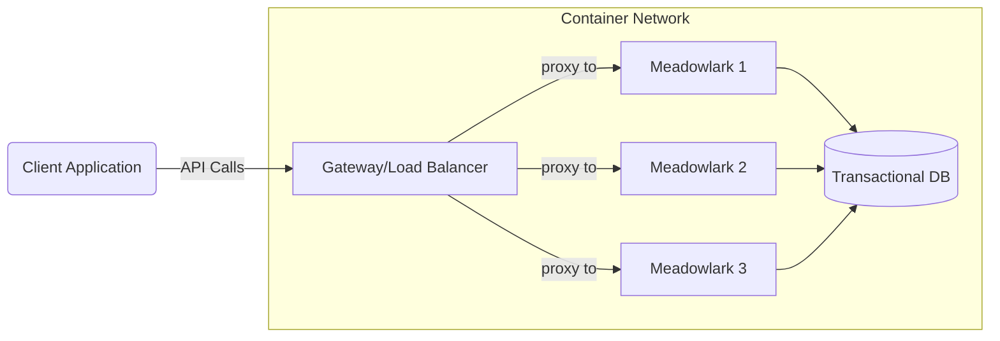
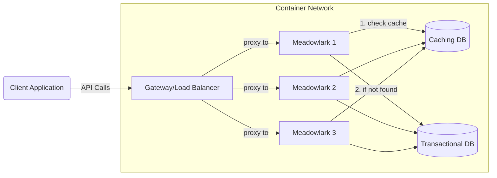
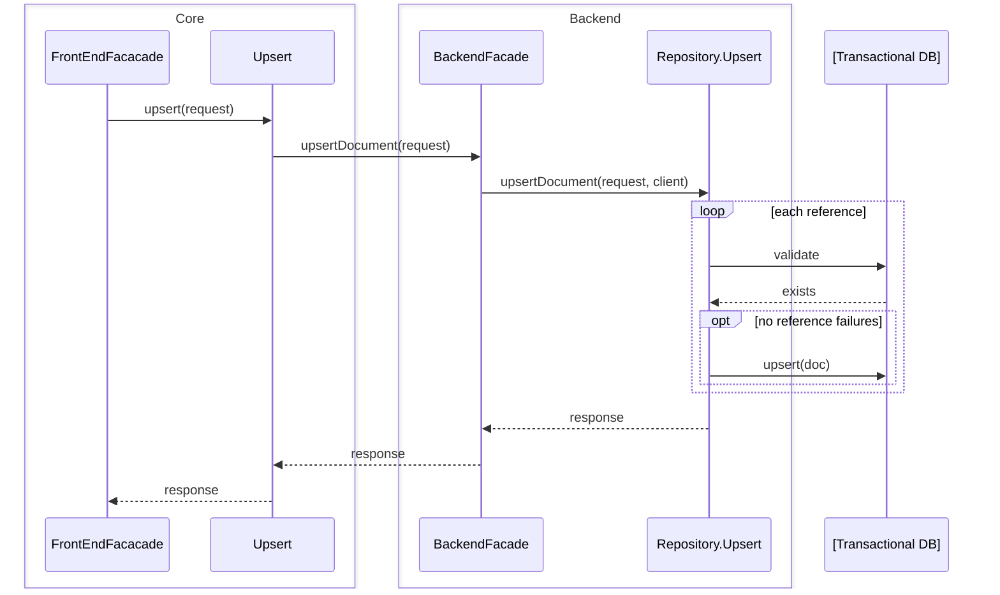
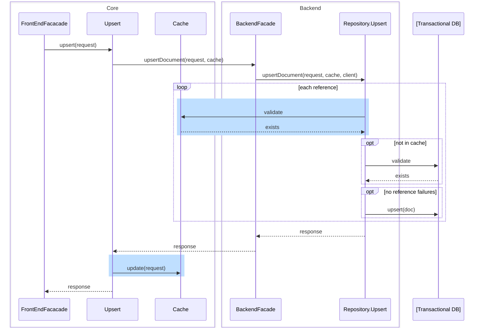

# Resource Caching for Performance Improvements

## Overview

Many data intensive applications gain substantial performance improvements by
caching some of their data in a repository that is closer to the application
code and/or has a faster access pattern. This document explores some of the
patterns, practices, and key areas for caching within Meadowlark.

Aspects to consider:

* Anticipated hotspots
* Access patterns (code level)
* Storage patterns (in-memory, external, distributed)
* Warm vs. cold cache
* Time to live and staleness

## Hotspots

The Ed-Fi ODS/API [has identified](https://techdocs.ed-fi.org/x/jIfqC) the
following hotspots where caching natural keys has provided significant
performance benefits:

* Descriptor URIs
* Unique ID's for parents, staff, and students

Caching these values within the application improves performance by limiting the
amount of work performed in the database and limiting the number of times the
database needs to be accessed. Similar considerations apply in Meadowlark.
Additionally, Meadowlark's in-code management of foreign keys means that there
are far more database calls: for example, in the ODS/API, the code can submit a
`StudentEducationOrganizationAssociation` to the relational database and wait
for it to respond if there are any foreign key violations. For Meadowlark, the
code must look up each foreign key in a separate call, leading to an explosion
of database requests.

As such, other frequently used key values may also benefit from caching.
Leveraging the ODS/API foreign key definitions, we can easily determine which
resources are the most utilized as foreign keys for other resources, not
including descriptors (which are a given):

1. EducationOrganization
2. Staff
3. Student
4. School
5. LearningStandard
6. Assessment
7. StudentEducationOrganizationAssociation --> covered by EducationOrganization
   and Student
8. Section
9. Program
10. GeneralStudentProgramAssociation --> covered by Program,
    EducationOrganization, and Student
11. Intervention
12. Course
13. InterventionPrescription
14. EducationContent
15. Parent

(Arbitrary cutoff at minimum 9 external references).

While these all have high connectivity, they may not all have high usage.
Ideally, Meadowlark would allow the system administrator to choose which
resources are cached. Initially, Meadowlark tuning should focus on the various
Descriptors followed by Education Organization, Staff, Student, and School. From
there it should be clear if we have a pattern for deployment-time tuning of
which resources to cover.

## Storage Patterns

The two primary choices are internal (in memory) vs. external caching. Within
external caching there are data monolithic vs. distributed data sources.

In memory caches are on the same machine where the application code runs. This
technique usually provide the highest performance, assuming the amount of data
to be cached fits in memory without crowding out the application. This pattern
works best for monolithic applications with high memory availability.

External caches can offer some benefit compared to accessing the raw data store,
particularly when the external cache is design to store in memory instead of on
disk. Distributed cache providers provide greater uptime and may be able to
bring the cache closer to multiple application nodes that are running behind a
load balancer.

Depending on the specific access patterns for the data, external caches may not
guarantee additional performance benefits compared to simply querying a
well-tuned transactional database. There is a danger of pre-optimizing when
dealing with theoretical data loads, as the Meadowlark development team must do.

Therefore it may be ideal to support multiple access patterns, allowing the
administrator to tune which resources are cached in memory and which are cached
externally.

**Load balanced application without caching or in-memory only**

**Load balanced application with external cache**

In this sense, "external" is relative to the API application; as shown, the
cache provider is inside the Docker network. It should also be trivial to
configure for access to a cache provider outside of the Docker network (e.g. a
managed service like Amazon Elasticache).

## Application Architecture

Currently, an Upsert request flows through the application code as shown in the
sequence diagram below:

One simple pattern is to introduce an [Identity
Map](https://martinfowler.com/eaaCatalog/identityMap.html), which could be
implemented by multiple providers, representing in-memory or external caches. It
may be convenient to split this module in two, so that common business logic
remains in the initial Identity Map, which then delegates out to a simple
provider that encapsulates data access.

Typically the Identity Map module would sit between the backend facade (as
labeled above) and the repository layer. However, we have validation logic
inside the repository. Thus we have two choices: insert the Identity Map inside
the repository, or refactor the backend repositories, moving the reference
validation into the Core modules. Refactoring would entail moving database
transaction logic around, which could get messy; protecting transaction scope
was the reason for placing the validation inside the repository layer.

Conclusion: we can inject a shared Identity Map and Cache Provider instance into
the repository (collectively labeled "Cache" below):

* add to core
* pass as instance to backend facade?
* or treat as singleton?
* show Repository.Upsert checking the cache
* then need to modify the cache; this could be done by the Core module

## Problem

Two load balanced instances, what if you update one? So long as we cache only
the natural key, doesn't matter, right? Deletes! So when running load balanced,
either need to recommend having an external cache or need to provide a way to
read delete events and apply in memroy. Seems like a bad idea.

## Dealing with Stale Data

From [Martin Fowler): TwoHardThings](https://martinfowler.com/bliki/TwoHardThings.html):

> "There are only two hard things in Computer Science: cache invalidation and
> naming things."
>
> -- Phil Karlton

