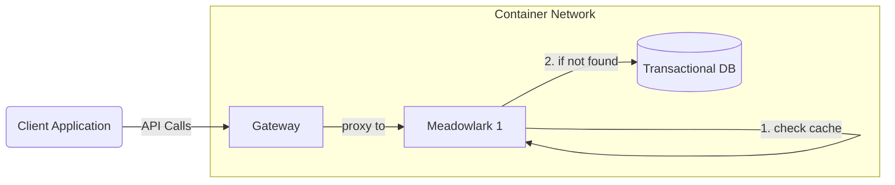
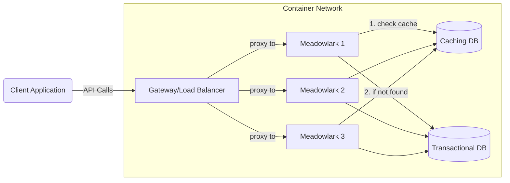
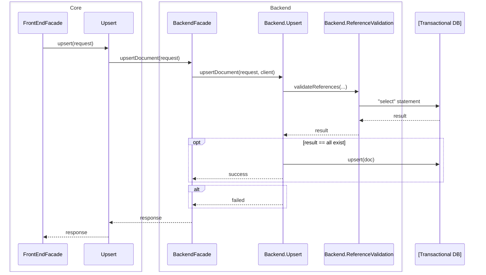
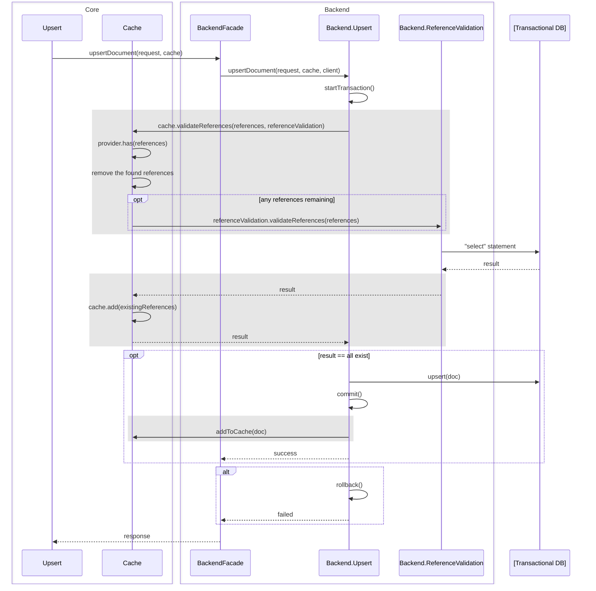

# Resource Caching for Performance Improvements

## Overview

Many data intensive applications gain substantial performance improvements by
caching some of their data in a repository that is closer to the application
code and/or has a faster access pattern relative to the transactional data
store. This document explores some of the patterns, practices, and key areas for
caching within Meadowlark.

Aspects to consider:

* Anticipated hotspots
* Access patterns (code level)
* Storage patterns (in-memory, external, distributed)
* Warm vs. cold cache
* Time to live and staleness

## Hotspots

The Ed-Fi ODS/API [has identified](https://techdocs.ed-fi.org/x/jIfqC) the
following hotspots where caching natural keys has provided significant
performance benefits:

* Descriptor URIs
* Unique ID's for parents, staff, and students

Caching these values within the application improves performance by limiting the
amount of work performed in the transactional data store and limiting the number
of times that database needs to be accessed. Similar considerations may apply in
Meadowlark, particularly with Descriptors. Additionally, Meadowlark's in-code
management of foreign keys means that there are far more database calls: for
example, in the ODS/API, the code can submit a
`StudentEducationOrganizationAssociation` to the relational database and wait
for it to respond if there are any foreign key violations. For Meadowlark, the
code must look up foreign keys in a separate call.

As such, other frequently used key values may also benefit from caching.
By studying the ODS/API foreign key definitions, we can easily determine which
resources are the most utilized as foreign keys for other resources, not
including descriptors (which are a given):

1. EducationOrganization
2. Staff
3. Student
4. School
5. LearningStandard
6. Assessment
7. StudentEducationOrganizationAssociation --> covered by EducationOrganization
   and Student
8. Section
9. Program
10. GeneralStudentProgramAssociation --> covered by Program,
    EducationOrganization, and Student
11. Intervention
12. Course
13. InterventionPrescription
14. EducationContent
15. Parent

(Arbitrary cutoff at minimum 9 external references).

While these all have high connectivity, they may not all have high usage.
Ideally, Meadowlark would allow the system administrator to choose which
resources are cached. Initially, Meadowlark tuning might only focus on
Descriptors, or could cover everything. Later optimizations might provide a
system administrator with the ability to fine tune which resources are covered
by caching.

## Storage Patterns

The two primary choices are internal (in memory) vs. external caching. Within
external caching there are monolithic vs. distributed data sources.

In memory caches are on the same machine where the application code runs. This
technique usually provide the highest performance, assuming the amount of data
to be cached fits in memory without crowding out the application. This pattern
works best for monolithic applications with high memory availability.

External caches can offer some benefit compared to accessing the raw data store,
particularly when the external cache is designed to store in memory instead of on
disk. Distributed cache providers provide greater uptime and may be able to
bring the cache closer to multiple application nodes that are running behind a
load balancer.

Depending on the specific access patterns for the data, external caches may not
guarantee additional performance benefits compared to simply querying a
well-tuned transactional database. There is a danger of pre-optimizing when
dealing with theoretical data loads, as the Meadowlark development team must do.
To alleviate this concern, system administrator should have a third choice: no
caching.

### In-memory Only

### Load Balanced Application with External Cache

In this sense, "external" is relative to the API application; as shown, the
cache provider is inside the Docker network. It should also be trivial to
configure for access to a cache provider outside of the Docker network (e.g. a
managed service like Amazon Elasticache). The cache provider itself might
distributed / clustered, though only a single node is shown.

## Application Architecture

### Architecture Before Adding Caching

An Upsert request (POST) flows through the application code as shown in the
sequence diagram below. Note that the `"select" statement` is meant to be a
generic term for SQL and equivalent commands in document databases. Furthermore,
note that there is no loop here: Meadowlark constructs a single find requests
with all reference IDs instead of generating separate requests for each
reference.

> **Note**
> In subsequent sequence diagrams, the `FrontEndFacade` will be
> omitted.

### Introducing a Cache Layer

One simple pattern is to introduce an [Identity
Map](https://martinfowler.com/eaaCatalog/identityMap.html), which could be
implemented with multiple backend providers, representing in-memory or external
caches. It will be convenient to split this module in two, so that common
business logic remains in the initial Identity Map module, which then delegates
out to a simple provider that encapsulates data access.

Typically the Identity Map module would sit between the backend facade (as
labeled above) and the repository layer. However, we have validation logic
inside the repository so that the validation checks are inside a transaction
context. Therefore the repository layer will need to know how to access the
cache layer.

To prevent the repository layer from accruing too much cache-related code, cache
management needs to be centralized in a `Cache` module (the Identity Map), which
can be placed in the `meadowlark-core` package. This also aids in avoid coding
duplication between different backend implementations. There will need to be
startup code to inject the right provider into the `Cache` module; these two are
treated as one "cache" in the sequence diagram below for simplicity. Then the
core `Upsert` module can inject the cache into the backend calls following the
Dependency Inversion principle.

The repository layer will ask the cache if the references exist. If the cache
does not contain the references, then it needs to go back to the repository
layer to check the transactional database. Any hits should be added to the cache
at that point, for use by subsequent API requests that need to validate the same
references. For efficiency when querying external provides, the Cache interface
needs to receive an array of ID's to lookup, rather than just a single ID each
time. Thus the code can use batch requests instead of individual service
requests for each ID.

### Extending Beyond the Upsert

The pattern explored above needs to be extended to cover all data modification
requests. For example, when a delete occurs, then there needs to be a command
out to the cache to remove that deleted item (if it is present). New documents
could be cached immediately, if that resource type is subject to caching.
Updated documents need to be evaluated: if the natural key changed, and thus the
calculated MeadowlarkId has changed, then the old ID must be removed and the new
one added.

### Managing What to Cache

The natural key needs to be stored; this can be done efficiently using the
calculated `MeadowlarkId`. The application code will easily be able to query by
this string value, which uniquely identifies a document.

Is there any need to restrict what can go into the cache? As explored earlier in
this document, there are some resources that are heavily used as references and
others lightly used. There is a concern that the cache size could grow too large
if low-value data are included. It may be necessary to add some restriction on
caching in the future. However, this kind of optimization should be avoided in
the initial implementation, keeping the code simple. We can provide three
options for now: cache nothing; cache only the descriptors; and cache everything.

### Lazy Loading

The solution described above uses a lazy loading approach, instead of
pre-warming the cache. Given the potential for a large cache, while there is no
restriction on which resources are included in the cache, this is the right
approach to avoid slow startup of the application. Otherwise, the application
would essentially need to pre-fetch _all_ references in the database and add the
to the cache - an expensive proposition.

## Dealing with Stale Data

From [Martin Fowler:
TwoHardThings](https://martinfowler.com/bliki/TwoHardThings.html):

> "There are only two hard things in Computer Science: cache invalidation and
> naming things."
>
> -- Phil Karlton

There are no _document contents_ to be concerned about - only ID values. There
are two obvious scenarios where stale data could become problematic: deleting a
document that is used as a reference for other documents, or modifying a natural
key (which is essentially deleting a document and replacing it). Take this
scenario for example:

1. Received a DELETE for a descriptor.
   1. Removal from transactional backend works.
   2. Removal from cache fails.
2. Receive a POST request that references that descriptor.
3. POST succeeds because the descriptor is cached, even though the request
   should have failed.

Two options for dealing with this are to make the cache update in the context of
the database transaction (so that cache failure triggers rollback), or manage the
cache downstream in an event-driven process.

The event-driven process sounds appealing because it is consistent with the
overall architectural pattern employed by Meadowlark. However, populating an
in-memory cache does not work well in such a system, because the entire data
store would need to be hot loaded whenever a new instance starts up. Populating
a cache data store in this case works best with lazy loading, which means it
needs to come from the API application. A delete operation could be event
driven, but comes with the potential for consistency problems and offers little
practical benefit if write operations are already coming directly from the API
application. Therefore the cache data store modifications need to be inline with
the backend transactions.

Another option is to provide a time-to-live (TTL) that will automatically flush
cached items after a certain period of time, thus forcing a continual refresh of
the lazy-loaded cache. At this time the approach seems unnecessary, as (a)
again, there is no _body_ to the values in the cache, so there is no update
(PUT) problem beyond the natural key, and (b) although it would ameliorate the
possibility of inconsistent state, it would not eliminate that possibility.

## Proof-of-Concept

See branch `SPIKE-CACHING`, which has rough code providing both an in-memory
cache and a Redis-based cache. In limited testing using the "load partial Grand
Bend" dataset, the timing for in-memory requests had clear improvement versus no
cache, and the Redis testing appeared to have a small improvement as well.
Improvements are more likely to be seen in load balanced situations and at
higher volumes.

The code in that branch does not fully represent the proposed module layers that
this document describes. Whomever implements the work should read the `// TODO`
comments carefully, review the proposed design above, and then make further
adjustments as the need emerges.

## Tentative Work Breakdown

1. Create the `Cache` module and a `NoCachingProvider` that ignores `add` and
   `remove` requests and always return an empty array for the `has` requests.
   Add the configuration support (env var) for reaching the cache provider
   setting, even though there is only one provider available.
2. Add an `InMemoryCachingProvider`.
   * Support switching to it via configuration.
   * Support a configuration switch for enabling resource caching (descriptor
     caching always on when using this provider).
   * Run bulk upload test three times with NoCaching and three times with
     InMemory, with Meadowlark running a container. Completely reset all
     databases between each run. Record test results in this document.
3. Similarly, add a `RedisCachingProvider`.
   * This should be in a separate backend package.
   * Same configuration options, plus support for the Redis connection
     information.
   * Add Redis in single-node configuration to the local docker compose
     infrastructure. Rerun the bulk performance tests and record results here,
     as in item 2.
