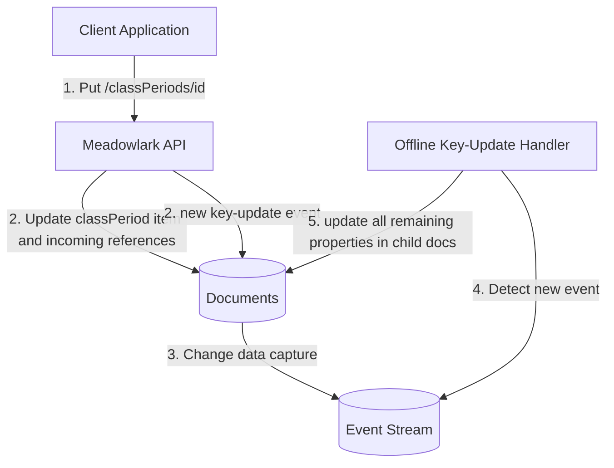
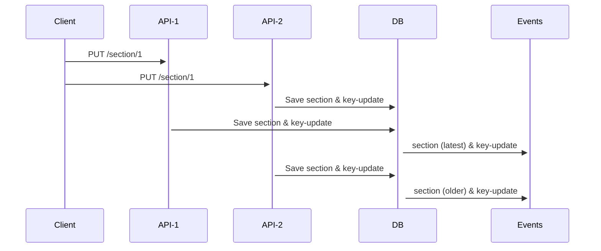
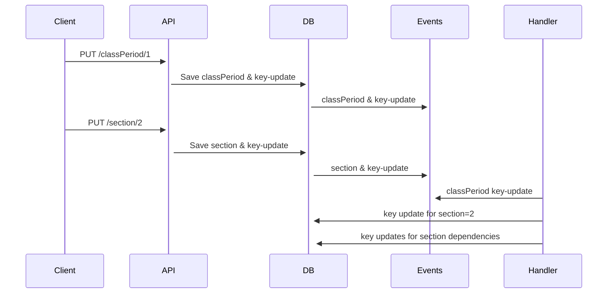

# Design for Offline Cascading Updates

## Overview

The Ed-Fi ODS/API [supports cascading
updates](https://techdocs.ed-fi.org/x/jgigBw) on
some resources' natural key values out of the box, and allows for customization
to support on all resources. In the Ed-Fi Data Standard version 3 and version 4,
the supported resources are:

* Class Period
* Grade
* GradebookEntry
* Location
* Section
* Session
* Student School Association
* Student Section Association

Cascading updates are not difficult in the ODS/API, because of its use of
relational database management systems that have strong support for this kind of
key change. _Note: neither the ODS/API nor Meadowlark support cascading deletes_.

The Meadowlark Ed-Fi API, on the other hand, uses document storage with no
inherent referential integrity. Therefore, if cascading updates are to be
implemented, they will require additional code-level support.

## Primer on Meadowlark Referential Integrity

Whether using [MongoDB](https://techdocs.ed-fi.org/x/yARqBw) or
[PostgreSQL](https://techdocs.ed-fi.org/x/ygRqBw), the Meadowlark handles
reference validation on POST, PUT, and DELETE requests through custom coding:

1. POST and PUT requests: if the document has references to other documents, do
   those references exist? Simple to lookup because Meadowlark uses a
   deterministic algorithm to hash the natural key (the [Meadowlark
   ID](https://techdocs.ed-fi.org/x/SwqgBw)), and it can then perform a query on
   that hash value to see if the referenced document exists.
2. DELETE requests: when requesting to delete a document, the Meadowlark API
   must reject the request if there is an _incoming reference_ to the document.
   Thus it must check for the existence of these incoming references.
    1. MongoDB: each document has an collection called `outboundRefs` containing
       Meadowlark ID that _this document_ references. There is an index on this
       collection, making it easy to query for any `outboundRefs` values that
       contain the document-to-be-deleted.
    2. PostgreSQL: the outbound references are instead in a separate table,
       simply called `References`.

→ [Meadowlark - Referential Integrity in Document
Databases](https://techdocs.ed-fi.org/x/SwqgBw)

## Illustrating the Problem

Let's say that you have a Section with a mistake. It has a five-part natural
key, derived from a combination of CourseOffering's natural key and a
SectionIdentifier. Perhaps there was a mistake and the API client needs to
update that SectionIdentifier, or the Section accidentally referenced the
CourseOffering for the Fall Semester instead of the Spring Semester.

In turn, every StudentSectionAssociation and every StudentSectionAttendanceEvent
contains the Section natural key, and these are just two of twenty different
resources that reference Section in Data Standard 4.0.

In the Glendale sample database - which is far from being a complete example of
all the data that could be stored - there is a particular section with 730
references across four tables. An RDBMS with cascading updates on foreign key
references should be able to handle that change very efficiently.

For referential integrity, we need to update all of these references.

## Requirements

1. Allow PUT requests to make natural key changes for all resources.
    1. POST request upserts _cannot_ make natural key changes, because they do
       not contain the unique ID string for the item.
2. _Cascade_ the key change to dependent resources for all eligible
   resources _and no other_.
3. Ensure that references are never out of sync, such that referential integrity
   would be temporarily (or permanently) broken.

## Introduce a Unique Resource ID

In milestone 0.2.0 (2022), reference management relied on the
deterministically-calculated [document
identifier](https://techdocs.ed-fi.org/x/SwqgBw). This technique makes it easy
to receive a document that contains references to other documents, and validate
that those documents actually exist: the lookup query is by the calculated
string value, instead of querying by a multi-part key.

However, there were two problems with that concept:

1. It will be easier to maintain referential integrity if the reference ID does
   not change when the keys change, and
2. We risk confusion for API clients.

With respect to the client confusion, consider this scenario, in psuedo-code:

```none
POST /ed-fi/something
{
  "sKeyPart1": "a",
  "sKeyPart2": "b",
  ...
}

--> status code 201; Location: /ed-fi/something/ABCD

PUT /ed-fi/something/ABCD
{
  "sKeyPart1": "a",
  "sKeyPart2": "I have been changed",
  ...
}

--> status code 204

GET /ed-fi/something/ABCD

--> status code 404!
```

The PUT request could return a new Location header, but this is an unusual
pattern that would require additional programming to handle. It will be better
not to change the URI.

Therefore, the location header should now contain a permanent Resource ID, which
is a UUID v4 identifier. This value will be stored with the document and with
the references for quick lookup. We will rename the existing Document ID as the
Meadowlark ID. This work will be done regardless of whether or not we proceed
with the cascade process described below.

### Example of a Document That References Another Document

**Initial State**

Document 1

```json
{
  "resourceId": "guid-1-does-not-change",
  "meadowlarkId": "documentIdForTheReferencedItem",
  "sKeyPart1": "a",
  "sKeyPart2": "b",
  ...
}​
```

Document 2

```json
{
  "resourceId": "guid-2-does-not-change",
  "meadowlarkId": "documentIdForThisItem",
  "sKeyPart1": "a",
  "sKeyPart2": "b",
  "elseKeyPart3": "c",
  "references": [
    {
      "resourceId": "guid-1-does-not-change",
      "meadowlarkId": "documentIdForTheReferencedItem"
    }
  ]
}​
```

In the "After" example below, please note the following attributes that are different than above:

* document 1:
  * meadowlarkId
  * sKeyPart2 (the modified portion of a natural key)
* document 2:
  * meadowlarkId
  * sKeypart2
  * references\[0\].meadowlarkId

**After the Update and Cascade**

Document 1

```json
{
  "resourceId": "guid-1-does-not-change",
  "meadowlarkId": "newDocumentIdForTheReferencedItem",
  "sKeyPart1": "a",
  "sKeyPart2": "new-value",
  ...
}​
```

Document 2

```json
{
  "resourceId": "guid-2-does-not-change",
  "meadowlarkId": "newDocumentIdForThisItem",
  "sKeyPart1": "a",
  "sKeyPart2": "new-value",
  "elseKeyPart3": "c",
  "references": [
    {
      "resourceId": "guid-1-does-not-change",
      "meadowlarkId": "newDocumentIdForTheReferencedItem"
    }
  ]
}​
```

## Online and Offline Transactions for Cascading

All of the changes shown above can be accomplished in a single transaction
scope. However, we need to strike a balance between the need for referential
integrity and the need for availability. In other words, if there are 1000
documents that reference a changed one, we don't want to (a) lock those 1000
records while waiting to process them all, and (b) prevent the API from
responding to the client (and then handling the next incoming request). This can
be accomplished through a combination of _online_ and _offline_ processing:

1. Online: update the main document's properties and all _reference_ values.
2. Offline: update the affected documents' properties.

The offline process can be handled through a work queue and an external handler,
running in a separate process from the main Meadowlark API application. In order
to guarantee consistency, the work queue will need to use the **[Outbox
Pattern](https://learn.microsoft.com/en-us/azure/architecture/best-practices/transactional-outbox-cosmos)**,
which enqueues the work request in the main data store as part of the online
transaction.



### Outbox Table

This table will be used for other events in [Meadowlark Streaming and Downstream
Data Stores](https://techdocs.ed-fi.org/x/UgWgBw).

| MongoDB Property | PostgreSQL Column | Description                                                                              | Required |
| ---------------- | ----------------- | ---------------------------------------------------------------------------------------- | -------- |
| ​eventType       | event_type        | Create separate event types depending on what action needs to be taken​.                 | yes​     |
| message          | message           | A JSON message.                                                                          | yes      |
| timestamp        | timestamp         | Datetime stamp (Unix) when record created.                                               | yes      |
| id               | id                | UUID v1, unique for the event (time-based is good here).                                 | yes      |
| partitionKey     | partion_key       | UUID v4, typically the DocumentUuid of the document that caused generation of the event. | yes      |

### Online Process - Outbox

1. Receive PUT request.
2. Check to see if the resource exists by looking up unique Document Uuid
   (pulled from URL)
    1. No: Return 404
3. Yes - exists
    1. Does calculated Meadowlark ID match the stored document?
        1. Yes - proceed with normal update
        2. No; Does the resource allow cascading?

            :bulb: The MetaEd model defines which resources are allowed to have
            natural key changes, with the language instruction `allow primary
            key updates`. Thus it will be possible, in the API, to quickly
            detect which resources are allowed to use the process described
            above.

            1. Yes - proceed to "START CASCADE UNIT OF WORK" below
            2. No - update the document _except for the natural key_. Just
               ignore the natural key update.
    2. START CASCADE **UNIT OF WORK**:
        1. Start atomic transaction
        2. Update the document as requested, including the new Meadowlark ID.
        3. Update all incoming references to hold the new Meadowlark ID, with
           code something like:

            ```none
            # MongoDB
            db.getCollection('documents').updateMany(
              { 'outboundRefs': '<OLD VALUE>' },
              { $set: { 'outboundRefs.$[elem]': '<NEW VALUE>' } },
              {
                upsert: false,
                writeConcern: <CONFIG VALUE>,
                arrayFilters: [ { 'elem': { $eq: '<OLD VALUE>' } } ]
              }
            )

            # PostgreSQL
            update references set parent_document_id = '<NEW VALUE>'
              where parent_document_id = '<OLD VALUE>';
            ```

        4. Write a record to the new Outbox collection/table, like:

              ```json
              {
                "eventType": "key-update",
                "event": {
                  "oldMeadowlarkId": <OLD VALUE>,
                  "newMeadowlarkId": <NEW VALUE>,
                  "newIdentity": {
                    "sKeyPart1": "a",
                    "sKeyPart2": "new-value",
                  }
                },
                "timestamp": <current Unix timestamp>,
                "id": <UUID v1>,
                "partitionKey": <UUID of changed document>
              }
              ```

        5. Commit transaction

### Dispatch

Events will be dispatched from the outbox to a message broker / queue through
changed data capture (CDC) using Debezium. See [Meadowlark Streaming and
Downstream Data Stores](https://techdocs.ed-fi.org/x/UgWgBw) for more
information.

### Offline Process - Event Handler / Stream Processor

There will be a monitoring service / function (details forthcoming) that detects
the `key-update` event and then takes action to fix dependencies. Naive approach:

1. For each document that references the `event.documentUuid` ("child document"):
   1. For each component of `event.newIdentity`: replace child document's value
      for matching key.
   2. Calculate the child document's new Meadowlark ID and update the document.
   3. Create a `key-update` event _for the child document_, so that any
      "grandchildren" of the original change will also receive the update.
   4. Create a `document-update` event for the child document, for updating
      OpenSearch (details forthcoming).

Why is this naive? Because it does not account for (at least) two conflict
situations.

1. Multiple updates to the key that are handled in the wrong order, and
2. Updates to both a parent key and a child document.

Note that the first problem, as described below, could occur with the ODS/API.
The second problem is unique to Meadowlark; it is not possible on in a
relational database.

#### Multiple updates

What if there are multiple updates to the key, and the events are handled in the
wrong order? Then the wrong update would end up "winning". This scenario could
occur when two different threads or processes accept HTTP requests. Conceivably,
an API client sends an update, then quickly sends a second update with a
correction. If the first one is processed slowly, then the erroneous update
might be the second in the event stream.



The problem needs to be resolved upstream of the events - before recording the
change in the primary data store. The likely solution is to have the API modify
the document _immediately on receipt_, enriching with a Unix timestamp property
`lastModifiedAt`. So long as the server times are in sync, then the API should
avoid writing an update if the stored value has a larger `lastModifiedAt`. To be
on the safe side, use similar logic in the event handling. This is a variation
of optimistic locking. It may be helpful to think of this timestamp as an
"identity version number".

So much for the main document. But what about the "child" documents? Those that
reference the changed document. One could look at timestamp there too, but there
is another scenario to consider.

#### Child Document is Also Updated

What if a dependency is _also_ updated?



Combine the two scenarios, with the following timestamps:

1. Receive `classPeriod` at API instance 1 (which is slow) first update at
   1682730047.
2. Receive `classPeriod` at API instance 2 (which is fast) second update at
   1682730049. Eventually updates `section` to also have 1682730049.
3. Receive `section` update at 1682730050, before the offline cascade takes
   effect. If coming from the same source system, and therefore has the new
   identity already:
   1. If it is a POST request, it will be treated as a new document to store,
      making the original obsolete. If we process the `key-update` event, it
      would change the old record to match the identity of the new record,
      resulting in a duplicate.
   2. If it is a PUT request, then it will be rejected because the record to
      update does not yet exist.

In the POST scenario, the offline handler must be able to gracefully fail to do
anything when it encounters a possible duplicate. The optimistic locking
mechanism already accounts for this: the POST to `section` would have a
timestamp in between that of the update to `classPeriod` and the offline
process, therefore the offline process would see that the `lastModifiedAt` for
the POST `section` is newer and the `key-update` event should ignore the record.
For the PUT request, the client would receive a 404 response and have to try
again.

#### Consolidated Offline Process

1. For each document that references the `event.documentUuid` ("child document"):
   1. If `event.lastModifiedAt` < `childDocument.identityLastModifiedAt`, then
      stop processing the event (event is out of date).
   2. For each component of `event.newIdentity`: replace child document's value
      for matching key.
   3. Calculate the child document's new Meadowlark ID and update the document.
   4. Create a `key-update` event _for the child document_, so that any
      "grandchildren" of the original change will also receive the update.
   5. Create a `document-update` event for the child document, for updating
      OpenSearch (details forthcoming).

## Tasks

1. Modify upsert to use optimistic lock based on `lastModifiedAt` timestamp. API
   must set that timestamp immediately on receipt of the message.
2. Create online Unit of Work, updating `outboundRefs` (MongoDB) / `references`
   (PostgreSQL) and writing to a new `outbox` collection or table.
3. Build offline handler: continuously running, monitoring event stream and
   performing key updates.
