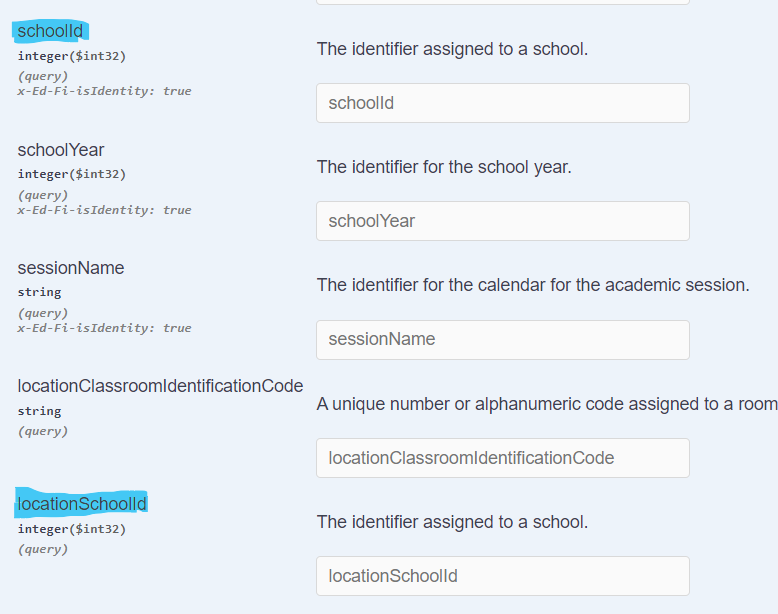
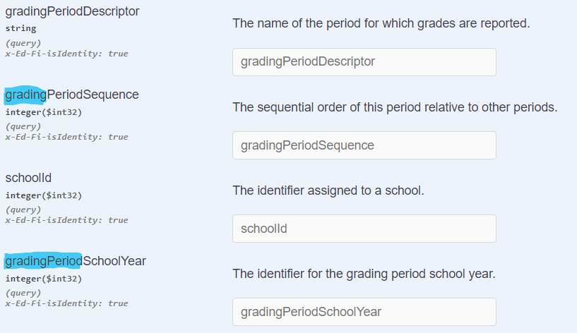

# Meadowlark - Get Search Pattern Gaps

## Problem Statement

The ODS/API supports a "Get search pattern" for retrieving documents for a resource using property values. However, the property values used for search often do not map neatly to properties in the resource document. This is because the search properties actually expose the column names of the underlying relational schema, and those names can follow complex rules.

### Decision Needed

> [!WARNING]
> **How important is it for Meadowlark to follow the "published" (de facto) Ed-Fi API specification with respect to query strings?**
> The Ed-Fi API Guidelines: [https://edfi.atlassian.net/wiki/spaces/EFAPIGUIDE/pages/24281161](https://edfi.atlassian.net/wiki/spaces/EFAPIGUIDE/pages/24281161) states "An Ed-Fi REST API *should* support querying capabilities when searching a collection of Resources." Therefore judging by the published guidelines, the query operations are not a strict requirement of an Ed-Fi compatible API. Those guidelines are neutral on the exact subject. Furthermore, the Ed-Fi API specification is not published as standard in itself; however, the API specification surfaced by the ODS/API has become a de facto standard, since it is the only widely available implementation of an API that uses the Ed-Fi Unified Data Model.
> Interestingly, those same API Guidelines suggest that an Ed-Fi API *should* implement a field selection parameter. This is not implemented by today's Ed-Fi ODS/API.

## Examples and Analysis

The expression of column naming in the search pattern examples below are in order of increasing complexity.

### Example 1: Simple and Role Naming on FeederSchoolAssociation

FeederSchoolAssociation provides two naming examples around schoolId. The document itself has two schoolIds, one as part of a standard School reference named schoolReference and one as part of a School reference with a Feeder role name, named feederSchoolReference:

These two schoolIds are searched on in the ODS/API as schoolId and feederSchoolId:

This is because in the database implementation role names are used as prefixes to column names, here to differentiate the column names that refer to the two different Schools.

| Search Field   | Document Property              |
| -------------- | ------------------------------ |
| schoolId       | schoolReference.schoolId       |
| feederSchoolId | feederSchoolReference.schoolId |

### Example 2: Simple Merge on Section

Section provides an example of a merge scenario where one search field maps to multiple document properties. A Section document has three schoolIds, one each for courseOfferingReference, locationReference, and locationSchoolReference:

These three schoolId document properties map to only two schoolIds in the search properties, schoolId and locationSchoolId:

This is because in the database implementation the schoolId column is unified as part of the foreign key reference to both the CourseOffering and Location tables. locationSchoolId is due to role naming as previously described in Example 1.

| Search Field     | Document Property                                               |
| ---------------- | --------------------------------------------------------------- |
| locationSchoolId | locationSchoolReference.schoolId                                |
| schoolId         | courseOfferingReference.schoolId and locationReference.schoolId |

### Example 3: Prefix Variations from Merge, Role Name and Name Collapsing on Grade

Grade provides an example of four different column naming variations within a single reference. The GradingPeriod reference on Grade is itself role named with GradingPeriod. As seen in Example 1, this typically results in the prefixing of reference properties with the role name, but variations are possible.

Note that in the document, gradingPeriodReference has the properties gradingPeriodDescriptor, periodSequence, and schoolYear:

Additionally, Grade has a schoolId on both gradingPeriodReference and studentSectionAssociationReference:

In the search properties, there is an inconsistency of prefixing in relation to these document properties. schoolId and gradingPeriodDescriptor are unchanged (for different reasons) while a "grading" prefix has been added to periodSequence and a "gradingPeriod" prefix has been added to schoolYear:

schoolId is unchanged because there is a merge between the schoolId in gradingPeriodReference and studentSectionAssociationReference, so they share the same column in the database. gradingPeriodDescriptor is unchanged because the role name of the reference (gradingPeriod) is collapsed on column names, causing it to effectively be ignored here. schoolYear becomes gradingPeriodSchoolYear for the normal role name reasons. periodSequence becomes gradingPeriodSequence because the overlap of the "period" between periodSequence and role name gradingPeriod is collapsed.

| Search Field            | Document Property                                                               |
| ----------------------- | ------------------------------------------------------------------------------- |
| schoolId                | gradingPeriodReference.schoolId and studentSectionAssociationReference.schoolId |
| gradingPeriodDescriptor | gradingPeriodReference.gradingPeriodDescriptor                                  |
| gradingPeriodSequence   | gradingPeriodReference.periodSequence                                           |
| gradingPeriodSchoolYear | gradingPeriodReference.schoolYear                                               |

## Options from the Meadowlark Dev Team

Meadowlark can use the MetaEd relational plugin to get these column names for ODS/API-like search support. We would need to build a mapping from them to document properties for querying as shown in the tables above. In the cases where there is one field for two properties, we will either need to choose one to search on or possibly "OR" the search on both.

As Meadowlark is a document-oriented implementation, it would make sense for it to continue to support searching based on the structure of the documents themselves. It would be a behavior that would be easy for clients to understand. It's worth considering whether to support both the ODS/API search style as well as a document style.
