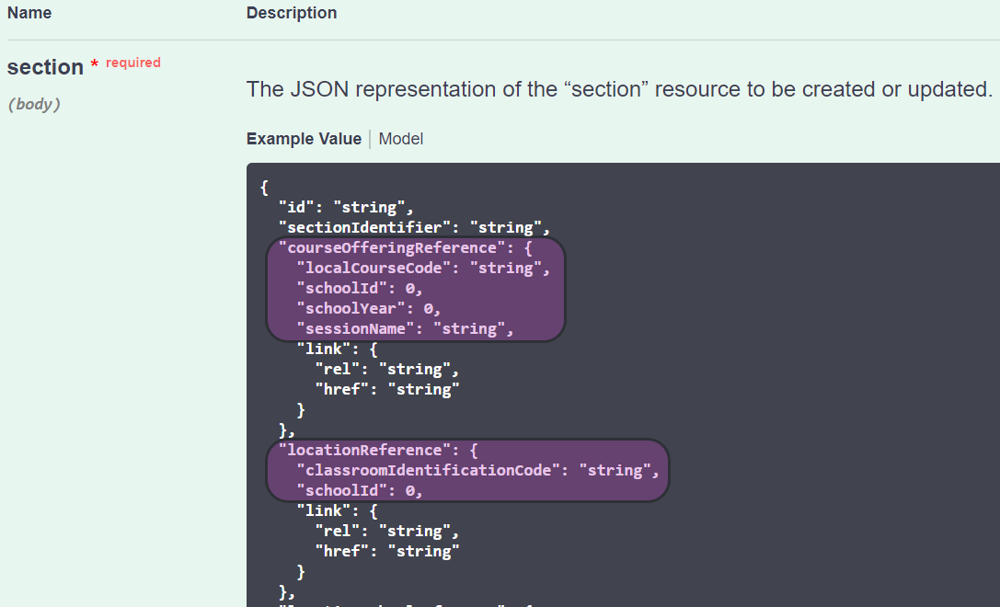

# Meadowlark - Leveraging MetaEd for API Parity

A primary goal of Meadowlark is to determine how to achieve rough parity with the existing ODS/API using NoSQL and cloud native technologies. The current architecture does this by leveraging Ed-Fi's MetaEd technology and taking a document-centric view of the existing API.

## MetaEd

Meadowlark makes extensive use of the backend [MetaEd IDE](https://docs.ed-fi.org/reference/metaed) code to interpret MetaEd model files, thus allowing the application to build an API surface from a Data Model at runtime instead of at compile time. This means that one application can support multiple data standards at the same time (that is, assuming that the [data storage design](../meadowlark-data-storage-design/meadowlark-dynamodb.md) will support this).

MetaEd is a domain-specific language created by the Ed-Fi Alliance to describe Ed-Fi core and extension data models. A single .metaed file describes a single data model entity. A MetaEd project is a set of .metaed files that together make up a complete model. MetaEd projects are versioned, and one project can extend another project.

## Document-centricity

The design of the existing API surface follows the Domain-Driven Design of the Ed-Fi model. Its clean separation into domains means that it well suited to be implemented in a document-centric fashion. A client submits a document representing an entity and gets back an ID to reference it in the future. Getting the document by ID for an entity returns the same document. Queries on entities by document fields return a series of documents in much the same way a document search engine would.

However, the API differs from a pure document store in three fundamental ways.

First and most obviously, the API imposes a specific structure (schema) for each document representing a particular type of entity. Each resource endpoint in the API represents a single document type each with its own structure.

Second, documents have a concept of uniqueness and identity separate from its generated resource ID. Each entity has some number of fields considered part of the identity of the entity. Together these fields uniquely identify a document. This maps to the "natural key" nature of the Ed-Fi model.

Finally, a document that references another entity is only valid if the referenced document is already stored in the API. Document references specify the identity fields ("natural key") of the entity being referenced. The API enforces reference validity on creates and updates, and disallows deletes that would cause a reference on an existing document to become invalid.

## Leveraging MetaEd for Validation

A MetaEd project contains all of the information needed to dynamically create a document-centric API that enforces relationship integrity. The architecture leverages MetaEd's plugin technology to load MetaEd projects and construct the same internal object model used by the MetaEd IDE. Meadowlark uses this model dynamically to achieve parity with the ODS/API for any MetaEd project, such as any version of the Ed-Fi core model.

### Resource Endpoints

Resource endpoint validation is the first and simplest part of achieving ODS/API parity. Meadowlark API requests are proxied to a validator that reads the URL and validates that the resource endpoint matches an entity in the internal model. Endpoints that do not are rejected. When possible, a "did you mean?" suggestion is provided in the error response.

### Schema Validation

Next, Meadowlark needs to validate that the shape of a POST/PUT body matches that of the ODS/API. The Meadowlark internal object model includes pre-computed JSON schema validators for each resource, using the Joi data validation framework. The relevant validator is applied to the POST/PUT body. A validation failure includes detailed information on how the document differs from the correct shape.

### Identity Extraction

Next, Meadowlark needs to extract the identity from the POST/PUT body to compare against documents already in the datastore. The Meadowlark internal object model includes a pre-computation of the location of the identity fields for each entity body. These are extracted and form the first part of a datastore transaction that checks for existence already in the datastore. The current behavior is to reject POST requests where there is already an entity with that identity in the datastore, and to reject PUT requests that attempt to change an entity to an identity that already exists.

The pre-computation consists of two phases. In the first phase (API mapping enhancement), the entire internal object model is annotated with a mapping from the MetaEd entity and property structure and naming to that of the API body for each entity. An excerpt of the annotation code for each entity and property is shown below.

In the second phase (reference component enhancement), every reference property in the internal model is annotated with the location in the body of the identities making up that reference. An excerpt of that annotation code is shown below.

### Reference Checking

Meadowlark allows for reference checking to be enabled or disabled via a "strict-validation" header with reference checking on by default to mirror ODS/API behavior while opening up new use case possibilities. This is done using the same  pre-computation of the location of all reference identity fields for each entity body. When enabled, the reference fields of the POST/PUT body are extracted and added as condition checks to the datastore transaction. A validation failure includes the first failed reference check from the datastore. DELETE reference checking to disallow other references to become invalid is not currently implemented in the datastore but should be straightforward to add.
