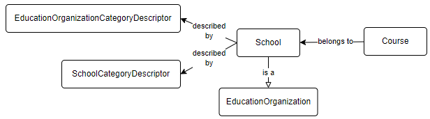

# Meadowlark - DynamoDB

OBSOLETE

> [!CAUTION]
> The Meadowlark development team learned much while developing the 0.1.0 milestone against DynamoDB. During the development of the next milestone, the team realized that there is a fatal flaw: there is no native support for transactional, distributed lock management. There is a [Java-based client](https://aws.amazon.com/blogs/database/building-distributed-locks-with-the-dynamodb-lock-client/) that provides a [pessimistic offline locking](https://www.martinfowler.com/eaaCatalog/pessimisticOfflineLock.html) mechanism that might work, but this is not useful for Meadowlark. Furthermore, the development team cannot afford to invest time building a custom locking mechanism. Therefore the support for DynamoDB is being removed from with the milestone 0.2.0 release.
> *Also see* *[Meadowlark - Referential Integrity in Document Databases](../meadowlark-data-storage-design/meadowlark-referential-integrity-in-document-databases.md)*.

## Overview

The development team chose AWS DynamoDB for the initial Meadowlark because of its lost cost storage and serverless nature, and also did some research around potential use of Cassandra (or Cosmos DB in Cassandra mode). Cassandra and DynamoDB are based on the same original architectural design, so the team felt that cross-platform lessons could be learned even while exploring only one of them in depth.

## Eventual Consistency

Highly scalable databases such as DynamoDB and Cassandra store multiple copies of the data for resiliency and high availability, and only one of these copies receives the initial write operation. The service guarantees that all other copies will eventually come up to date with that initial write operation: the data will *eventually be consistent*. The tradeoff is in favor of connection reliability: queries are not blocked by write operations.[](https://docs.aws.amazon.com/amazondynamodb/latest/developerguide/HowItWorks.ReadConsistency.html)

Many people find this disturbing at first, if they are used to thinking about transaction locking in relational databases. But the reality is less scary than it sounds.

[Amazon states](https://docs.aws.amazon.com/amazondynamodb/latest/developerguide/HowItWorks.ReadConsistency.html) that it typically takes "one second or less" to bring all copies up to date. Let's compare the outcomes of the following three scenarios:

| Time | Scenario 1 | Scenario 2 | Scenario 3 |
| --- | --- | --- | --- |
| 10:01:01.000 AM | **Client A reads a record** | Client B writes an update to that record | Client B writes an update to that record |
| 10:01:01.500 AM (half second) | Client B writes an update to that record | **Client A reads a record** | All DynamoDB copies are up-to-date |
| 10:01:02.000 AM (full second) | All DynamoDB copies are up-to-date | All DynamoDB copies are up-to-date | **Client A reads a record** |
| *Status* | *Client A has stale data* | *Client A* might *have stale data* | *Client A has current data* |

In Scenario 1, Client A receives stale data because they requested it *half a second* before Client B writes an update. *And this is no different than in a relational database*.

In Scenario 2, the Client B writes an update *half a second* before Client A sends a read. Client A might coincidentally be assigned to read from the first database node that received the record, or it might read from a node that is lagging by half a second. Thus it *might* get stale data, though this is not guaranteed.

Finally in Scenario 3, Client A asks for a record a full second after Client B had written an update, and Client A is *nearly* guaranteed to get the current (not stale) data. *Again, same as with a standard relational database*.

The practical difference between the guaranteed consistency of a relational database and the eventual consistency of a distributed database like DynamoDB is thus more a matter of happenstance than anything else. In either case, if Client A reads from the system a millisecond before Client B writes, then Client A will have stale data. If Client A reads *after*  Client B writes, then the window of time for getting stale data goes up to perhaps a second. *But if they do get stale data, they will never know that they weren't in scenario 1.*

Eventual consistency is likely "good enough." But it does deserve further community consideration before using it in a production system.

## Storage Design

Meadowlark uses the [single-table design](https://aws.amazon.com/blogs/compute/creating-a-single-table-design-with-amazon-dynamodb/) approach for storage in DynamoDB, with the following structure:

| Column Name | Purpose |
| --- | --- |
| info | Contains the JSON document for a resource |
| pk​ | Hash key (aka partition key) - one half of the primary key​. |
| naturalKey | Plain text version of the natural key |
| sk  | Range key (aka sort key) - the other half of the primary key |

There are also a couple of experimental columns and secondary indexes for exploring relationship-based authorization.

Meadowlark creates a unique resource ID by calculating a  [SHA-3](https://en.wikipedia.org/wiki/SHA-3) (cShake 128) hash value from the natural key. This value is stored as the sort key, `sk` . The partition key, `pk` , contains entity type information: schema, model version, and domain entity name.

> [!TIP]
> In DynamoDB, an "item" is analogous to a "record" in a relational database. Thus a single object being stored in a DynamoDB table is stored as "an item".

## Streaming to OpenSearch

DynamoDB has native change data capture streaming. The change stream can trigger execution of a Lambda function. This function in turn can write data out to OpenSearch.

## Referential Integrity

An important feature of an Ed-Fi API is the ability to enforce referential integrity, rejecting modification requests where the modified item refers to another item that does not actually exist. An Ed-Fi API also rejects attempts to delete items that are referred to by other items.

Most NoSQL databases do not support referential integrity, whereas the ODS/API Platform leverages referential integrity checking built into the SQL database. Therefore Meadowlark had to develop its own system for referential integrity checks, in application code. In short, Meadowlark transactionally writes extra items to the transactional database with pointers to the referenced items. These items are trivial to look up.

> [!WARNING]
>
> Due to eventual consistency, there is a small but real possibility of a referential integrity check *miss* *.* To what extent does this matter?  Another question for the community to explore.

To illustrate: assume that a Meadowlark instance already has descriptors loaded, and an API client wants to load a School and a Course that belongs to that school. Adding excitement to the scenario: in the Ed-Fi Data Model, a School *is an* Education Organization (extends / inherits).



Below is the successful POST request to create the new school:

**Request**

```
POST http://aws-created-url/stage-name/v3.3b/ed-fi/schools

{
    "schoolId": 122,
    "nameOfInstitution": "A School",
    "educationOrganizationCategories" : [
        {
            "educationOrganizationCategoryDescriptor": "uri://ed-fi.org/EducationOrganizationCategoryDescriptor#Other"
        }
    ],
    "schoolCategories": [
        {
             "schoolCategoryDescriptor": "uri://ed-fi.org/SchoolCategoryDescriptor#All Levels"
        }
    ],
    "gradeLevels": []
}
```

**Response**

```
HTTP/1.1 201 Created
x-metaed-project-name: Ed-Fi
x-metaed-project-version: 3.3.1-b
x-metaed-project-package-name: ed-fi-model-3.3b
location: /v3.3b/ed-fi/schools/7a5cf3f4a68015c0922e24c73401a21e9fd1767ef60c0b3300f2301e
content-type: application/json; charset=utf-8
vary: origin
access-control-allow-credentials: true
access-control-expose-headers: WWW-Authenticate,Server-Authorization
cache-control: no-cache
content-length: 0
Date: Mon, 06 Dec 2021 14:47:42 GMT
Connection: close

```

Since there are two descriptors, the application code must validate that those are legitimate descriptors. The following DynamoDB items exist, therefore the Post is validated:

* SchoolCategory
  * pk = ​TYPE#Ed-Fi#3.3.1-b#SchoolCategoryDescriptor
  * sk = ID#0f1474d47271406f6b47eabeba2fca6dd5a8b49a3b9d4e5b8d0e87e8
  * naturalKey = ​NK#**[uri://ed-fi.org/SchoolCategoryDescriptor#All] Levels**
  * info =  {"namespace":{"S":"[uri://ed-fi.org/SchoolCategoryDescriptor"},"description":{"S":"All] Levels"},"shortDescription":{"S":"All Levels"},"\_unvalidated":{"BOOL":true},"codeValue":{"S":"All Levels"}}
* EducationOrganizationCategoryDescriptor
  * pk = TYPE#Ed-Fi#3.3.1-b#EducationOrganizationCategoryDescriptor
  * sk = ID#04c7f019c56684b0539135ab2d955e4c03bc85b3841cdd87fb970f35
  * naturalKey = NK#**[uri://ed-fi.org/EducationOrganizationCategoryDescriptor#Other]**
  * info =  {"namespace":{"S":"[uri://ed-fi.org/EducationOrganizationCategoryDescriptor"},"description":{"S":"Other"},"shortDescription":{"S":"Other"},"\_unvalidated":{"BOOL":true},"codeValue":{"S":"Other]"}}

Now that the POST has been accepted, Meadowlark saves the following records in a transaction:

* School
  * pk = ​TYPE#Ed-Fi#3.3.1-b#School
  * sk = ID#7a5cf3f4a68015c0922e24c73401a21e9fd1767ef60c0b3300f2301e​
  * naturalKey = NK#schoolId=122
  * info = {"educationOrganizationCategories":{"L":\[{"M":{"educationOrganizationCategoryDescriptor":{"S":"[uri://ed-fi.org/EducationOrganizationCategoryDescriptor#Other"}}}\]},"schoolCategories":{"L":\[{"M":{"schoolCategoryDescriptor":{"S":"uri://ed-fi.org/SchoolCategoryDescriptor#All] Levels"}}}\]},"gradeLevels":{"L":\[\]},"schoolId":{"N":"122"},"nameOfInstitution":{"S":"A School"}}
* Education Organization
  * pk = TYPE#Ed-Fi#3.3.1-b#EducationOrganization
  * sk = ASSIGN#ID#7a5cf3f4a68015c0922e24c73401a21e9fd1767ef60c0b3300f2301e

The second item, of type "Assign", helps to recognize entity super types when performing referential integrity validation checks. Please note that the hash value in the Assign item's `sk`  matches the hash value for the individual school.

Now that there is a school, the client next creates a new Course, which has a reference to Education Organization. In this scenario, that Education Organization will be the School that was just created. For referential integrity, Meadowlark must determine if the Education Organization Id actually exists. Based on the payload, Meadowlark doesn't "know" to look for a *School* with this particular Education Organization Id – could be a Local or State Education Agency, for example. Hence the creation of the Assign item with `TYPE#Ed-Fi#3.3.1-b#EducationOrganization`  and the School's natural key hash value, which Meadowlark uses for the integrity lookup.

**Request**

```
POST http://aws-created-url/stage-name/v3.3b/ed-fi/courses

{
    "educationOrganizationReference": {
        "educationOrganizationId": 122
    },
    "courseCode": "1234",
    "courseTitle": "A Course",
    "numberOfParts": 1,
    "identificationCodes": []
}
```

**Response**

```
HTTP/1.1 201 Created
x-metaed-project-name: Ed-Fi
x-metaed-project-version: 3.3.1-b
x-metaed-project-package-name: ed-fi-model-3.3b
location: /v3.3b/ed-fi/courses/2717e6e9275502cb2da0e3bdbf5c2ba3395f9e2117bdc7e03c216138
content-type: application/json; charset=utf-8
vary: origin
access-control-allow-credentials: true
access-control-expose-headers: WWW-Authenticate,Server-Authorization
cache-control: no-cache
content-length: 0
Date: Mon, 06 Dec 2021 15:32:03 GMT
Connection: close
```

As Course does not extend any other entity, there is no need for it to have a complementary Assign item. However, another type of referential integrity comes into play now: we must make sure that no client can delete the School without first deleting the referencing Course.  Meadowlark handles this by creating additional items along with the Course: one pointing from Course to School and one in reverse, making it easy to lookup the relationship in either direction.

* Course
  * pk = TYPE#Ed-Fi#3.3.1-b#Course
  * sk = ID#2717e6e9275502cb2da0e3bdbf5c2ba3395f9e2117bdc7e03c216138

  * naturalKey = NK#courseCode=1234#educationOrganizationReference.educationOrganizationId=12
  * info = {"courseTitle":{"S":"A Course"},"numberOfParts":{"N":"1"},"educationOrganizationReference":{"M":{"educationOrganizationId":{"N":"122"}}},"identificationCodes":{"L":\[\]},"courseCode":{"S":"1234"}}
* From Course To School
  * pk = FREF#ID#2717e6e9275502cb2da0e3bdbf5c2ba3395f9e2117bdc7e03c216138
  * sk = TREF#ID#7a5cf3f4a68015c0922e24c73401a21e9fd1767ef60c0b3300f2301e
* To School From Course
  * pk = TREF#ID#7a5cf3f4a68015c0922e24c73401a21e9fd1767ef60c0b3300f2301e
  * sk = FREF#ID#2717e6e9275502cb2da0e3bdbf5c2ba3395f9e2117bdc7e03c216138
  * info = {"Type":{"S":"TYPE#Ed-Fi#3.3.1-b#Course"},"NaturalKey":{"S":"NK#courseCode=1234#educationOrganizationReference.educationOrganizationId=122"}}

The `info`  column in the "to ... from" item allows Meadowlark to provide a meaningful message when it rejects a Delete request based on referential integrity:

**Request**

```
DELETE  http://aws-created-url/stage-name/v3.3b/ed-fi/schools/7a5cf3f4a68015c0922e24c73401a21e9fd1767ef60c0b3300f2301e
```

**Response**

```
HTTP/1.1 409 Conflict
x-metaed-project-name: Ed-Fi
x-metaed-project-version: 3.3.1-b
x-metaed-project-package-name: ed-fi-model-3.3b
content-type: application/json; charset=utf-8
vary: origin
access-control-allow-credentials: true
access-control-expose-headers: WWW-Authenticate,Server-Authorization
cache-control: no-cache
content-length: 741
Date: Mon, 06 Dec 2021 15:51:10 GMT
Connection: close

{
  "error": "Unable to delete this item because there are foreign keys pointing to it",
  "foreignKeys": [
    {
      "NaturalKey": "NK#courseCode=1234#educationOrganizationReference.educationOrganizationId=122",
      "Type": "TYPE#Ed-Fi#3.3.1-b#Course"
    }
  ]
}
```

## References

* Alex DeBrie's [DynamodDB Guide](https://www.dynamodbguide.com/) and [The DynamoDB Book](https://www.dynamodbbook.com/)
* [Single table design with DynamoDB](https://www.youtube.com/watch?v=BnDKD_Zv0og). "Covers a fair amount of his book content".
* [re:Invent 2019 - DynamoDB Deep Dive](https://www.youtube.com/watch?v=6yqfmXiZTlM)
* [re:Invent 2020 - DynamoDB Advanced Design Patterns, part 1](https://www.youtube.com/watch?v=MF9a1UNOAQo)
* [re:Invent 2020 - DynamoDB Advanced Design Patterns, part 2](https://www.youtube.com/watch?v=_KNrRdWD25M)
