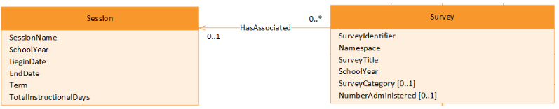

# Meadowlark - Referential Integrity in Document Databases

## Introduction

Relational databases have robust support for relationship management. Naturally 😉. And document databases do not. This article reviews the steps taken in project Meadowlark to ensure a high level of referential integrity for data submitted to the API.

## Scenarios

The following diagram is from the Ed-Fi Data Model 3.3 documentation on the [Survey Domain](https://edfi.atlassian.net/wiki/spaces/EFDS33/pages/26968421/Survey+Domain+-+Model+Diagrams), simplified to show a single relationship: a Survey has an associated Session. This will be our exemplar that stands in for many different situations in the Ed-Fi Data Model.



One of the key concepts behind the Ed-Fi system is to ensure a high degree of validity to data. Aside from enforcing some basic type constraints (e.g. not submitting a SchoolYear "202eeee"), the primary validation rule is to ensure that related entities exist and to prevent removing one entity when another entity references it. Within Meadowlark, because of the NoSQL database design, these entities take the form of JSON *documents,* which are analogous to the *records* found in a traditional relational database.

Relational databases enforce this reference validation through foreign keys. Document databases do not – at least, not traditionally, or as a general pattern. Thus Meadowlark must have custom code to account for the following situations:

1. **Create a Survey**: does the session exist? No: respond with status 400 bad request and do not save the document. Yes: save the document.
2. **Update a Survey**: does the session exist? No: respond with status 400 bad request and do not save the document. Yes: replace the document.
3. **Delete a Session**: are there any Surveys that reference this session? Yes: respond with status 409 conflict. No: delete the document.

Imagine the following sequence of actions being taken virtually simultaneously by two different API clients:

| one | two |
| --- | --- |
| ​begin transaction | ​   |
| delete document A | begin transaction |
|     | if document A exists:<br><br>    save document B<br><br>else:<br><br>    error |
| commit | commit |

How do we accomplish this safely?

## Referential Integrity Pattern

The basic pattern that Meadowlark employs for reference validation is to convert the identity and reference portions of a document into document ids. Reference validation then consists of simple document id lookups, which are possible even in key/value-like datastores. However, in order to maintain consistency during validation a datastore must support ACID transactions. It must also provide a way to lock documents on reads in a transaction such that Meadowlark upserts, updates and deletes can stay consistent with those referenced documents.

## Solutions

### DynamoDB

DynamoDB provides ACID transactions. It also provides transaction "condition checks" that are like read locks, but have limitations on what can be checked. It turns out that condition checks are too limited to support consistent delete operations with the Meadowlark pattern. Instead, it would require a more generalized read locking behavior.

There is no built-in solution for this in DynamoDB. There is a [java client](https://aws.amazon.com/blogs/database/building-distributed-locks-with-the-dynamodb-lock-client/) that introduces pessimistic offline locking support - in other words, a client locks a record by updating a `lock`  column with a unique value. Other clients can't access that record until the `lock`  column is cleared. This *might* be sufficient to support the Meadowlark pattern. However, the development team is not going to develop the JavaScript code to investigate or support this.  This may need to be a full replacement for native DynamoDB transactions, and the performance implications are unclear.

> [!CAUTION]
> Therefore DynamoDB will be removed from Meadowlark release 0.2.0.

### PostgreSQL (using non-relational pattern)

PostgreSQL has built-in mechanisms for [explicitly locking a record](https://www.postgresql.org/docs/current/explicit-locking.html). These can be used either to prevent a competing DELETE from occurring in the middle of an INSERT or UPDATE transaction, or to prevent an INSERT or UPDATE from occurring during a previously-started DELETE transaction.

The article [Selecting for Share and Update in PostgreSQL](https://shiroyasha.io/selecting-for-share-and-update-in-postgresql.html) does a nice job of explaining two of the lock modes: `select for share`  and `select for update`.

With a plain select statement by client two, the save will proceed... which is NOT what we want to happen. To resolve that, we can append `for share nowait` at the end of the select statement. This will have the effect of locking document A against updates momentarily, without locking out *reads* by any other client. If client one has already issued a delete statement, however, then the lock will fail. The `nowait`  keyword tells the database engine to fail immediately, rather than wait for client one's lock to be released.

The following code demonstrates the desired behavior:

```javascript
const pg = require('pg');
const { exit } = require('process');

const dbConfiguration = {
  host: process.env.POSTGRES_HOST ?? 'localhost',
  port: Number(process.env.POSTGRES_PORT ?? 5432),
  user: process.env.POSTGRES_USER,
  password: process.env.POSTGRES_PASSWORD,
  database: process.env.MEADOWLARK_DATABASE_NAME ?? 'meadowlark',
};

const parentId = `parent${Math.random() * 100}`;
const referencingDocumentId = `reference${Math.random() * 1000}`;

async function RunTest() {
  const clientOne = new pg.Client(dbConfiguration);
  await clientOne.connect();
  const clientTwo = new pg.Client(dbConfiguration);
  await clientTwo.connect();

  // Create sample records
  const insertParent = `
    insert into meadowlark.documents (document_id, document_identity, project_name, resource_name, resource_version, is_descriptor, validated, edfi_doc)
      values ('${parentId}', '{}', 'edfi', 'test', '3.3b', False, True, '{}');
    `;
  await clientOne.query('begin');
  await clientOne.query(insertParent);
  await clientOne.query('commit');

  // Issue a delete statement _without_ committing the transaction
  const deleteParent = `delete from meadowlark.documents where document_id = '${parentId}';`;
  await clientOne.query('begin');
  await clientOne.query(deleteParent);

  // And now in a separate client, try to insert a doc that references the parent
  const referenceCheck = `
    select id from meadowlark.documents where document_id = '${parentId}';
  `;
  const insertReference = `
    insert into meadowlark.documents (document_id, document_identity, project_name, resource_name, resource_version, is_descriptor, validated, edfi_doc)
      values ('${referencingDocumentId}', '{}', 'edfi', 'test', '3.3b', False, True, '{}');
    insert into meadowlark.references (parent_document_id, referenced_document_id)
      values ('${parentId}','${referencingDocumentId}');`;
  try {
    await clientTwo.query('begin');
    const res = await clientTwo.query(referenceCheck);
    if (res.rows.length === 0) {
      console.info('no record found! an API would return 400 due to missing parent.');
      exit();
    }

    await clientTwo.query(insertReference);
    await clientTwo.query('commit');
  } catch (error) {
    console.info('unexpected failure on initial insert of reference');
    console.error(error);
  }

  // That didn't fail! Try now using the SELECT ... FOR UPDATE approach. "nowait" is essential here; if you remove it, then
  // clientTwo will wait for clientOne to finish.
  const selectForUpdate = `
    select id from meadowlark.documents where document_id = '${parentId}' for share nowait;
    insert into meadowlark.documents (document_id, document_identity, project_name, resource_name, resource_version, is_descriptor, validated, edfi_doc)
      values ('${referencingDocumentId}', '{}', 'edfi', 'test', '3.3b', False, True, '{}');
    insert into meadowlark.references (parent_document_id, referenced_document_id)
      values ('${parentId}','${referencingDocumentId}');`;

  try {
    await clientTwo.query('begin');
    await clientTwo.query(selectForUpdate);
  } catch (error) {
    console.info('EXPECTED failure on second insert reference');
    console.info(error);
  }

  // Close these clients in reverse order
  clientOne.query('commit');
  clientTwo.query('commit');

  // Cleanup
  clientOne.end();
  clientTwo.end();
}

RunTest().finally(() => console.log('Done'));
```

## MongoDB

MongoDB supports ACID transactions but does not have native lock-on-read support. However, there is a common pattern used to simulate this by updating documents using a randomly-generated lock field. See the MongoDB blog post [How to SELECT...FOR UPDATE Inside MongoDB Transactions](https://www.mongodb.com/blog/post/how-to-select--for-update-inside-mongodb-transactions) for details.

By implementing the lock field pattern, MongoDB transactions will fail with a `WriteConflict` if, for example, a document read in one transaction is deleted in another. These transactions can then be retried or reported back to the client as a conflict, as appropriate.

The following unit test code demonstrates the desired behavior:

 Expand source

```javascript
// SPDX-License-Identifier: Apache-2.0
// Licensed to the Ed-Fi Alliance under one or more agreements.
// The Ed-Fi Alliance licenses this file to you under the Apache License, Version 2.0.
// See the LICENSE and NOTICES files in the project root for more information.

import {
  DocumentInfo,
  NoDocumentInfo,
  newDocumentInfo,
  newSecurity,
  documentIdForDocumentInfo,
  DocumentReference,
  UpsertRequest,
  NoResourceInfo,
  ResourceInfo,
  newResourceInfo,
} from '@edfi/meadowlark-core';
import { ClientSession, Collection, MongoClient, ObjectId } from 'mongodb';
import { MeadowlarkDocument, meadowlarkDocumentFrom } from '../../../src/model/MeadowlarkDocument';
import { getCollection, getNewClient } from '../../../src/repository/Db';
import {
  validateReferences,
  asUpsert,
  onlyReturnExistenceIds,
  onlyDocumentsReferencing,
  onlyReturnId,
} from '../../../src/repository/ReferenceValidation';
import { upsertDocument } from '../../../src/repository/Upsert';

jest.setTimeout(10000);

// A bunch of setup stuff
const newUpsertRequest = (): UpsertRequest => ({
  id: '',
  resourceInfo: NoResourceInfo,
  documentInfo: NoDocumentInfo,
  edfiDoc: {},
  validate: false,
  security: { ...newSecurity() },
  traceId: 'traceId',
});

const schoolResourceInfo: ResourceInfo = {
  ...newResourceInfo(),
  resourceName: 'School',
};

const schoolDocumentInfo: DocumentInfo = {
  ...newDocumentInfo(),
  documentIdentity: [{ name: 'schoolId', value: '123' }],
};
const schoolDocumentId = documentIdForDocumentInfo(schoolResourceInfo, schoolDocumentInfo);

const referenceToSchool: DocumentReference = {
  projectName: schoolResourceInfo.projectName,
  resourceName: schoolResourceInfo.resourceName,
  documentIdentity: schoolDocumentInfo.documentIdentity,
  isDescriptor: false,
};

const academicWeekResourceInfo: ResourceInfo = {
  ...newResourceInfo(),
  resourceName: 'AcademicWeek',
};
const academicWeekDocumentInfo: DocumentInfo = {
  ...newDocumentInfo(),
  documentIdentity: [
    { name: 'schoolId', value: '123' },
    { name: 'weekIdentifier', value: '1' },
  ],
  documentReferences: [referenceToSchool],
};
const academicWeekDocumentId = documentIdForDocumentInfo(academicWeekResourceInfo, academicWeekDocumentInfo);

const academicWeekDocument: MeadowlarkDocument = meadowlarkDocumentFrom(
  academicWeekResourceInfo,
  academicWeekDocumentInfo,
  academicWeekDocumentId,
  {},
  true,
  '',
);

describe('given a delete document transaction concurrent with an insert document referencing the delete - without a read for write lock ', () => {
  let client: MongoClient;

  beforeAll(async () => {
    client = (await getNewClient()) as MongoClient;
    const mongoCollection: Collection<MeadowlarkDocument> = getCollection(client);

    // Insert a School document - it will be referenced by an AcademicWeek document while being deleted
    await upsertDocument({ ...newUpsertRequest(), id: schoolDocumentId, documentInfo: schoolDocumentInfo }, client);

    // ----
    // Start transaction to insert an AcademicWeek - it references the School which will interfere with the School delete
    // ----
    const upsertSession: ClientSession = client.startSession();
    upsertSession.startTransaction();

    // Check for reference validation failures on AcademicWeek document - School is still there
    const upsertFailures = await validateReferences(
      academicWeekDocumentInfo.documentReferences,
      [],
      academicWeekDocument.outRefs,
      mongoCollection,
      upsertSession,
      '',
    );

    // Should be no reference validation failures for AcademicWeek document
    expect(upsertFailures).toHaveLength(0);

    // ----
    // Start transaction to delete the School document - it interferes with the AcademicWeek insert referencing the School
    // ----
    const deleteSession: ClientSession = client.startSession();
    deleteSession.startTransaction();

    // Get the existenceIds for the School document, used to check for references to it as School or as EducationOrganization
    const deleteCandidate: any = await mongoCollection.findOne(
      { _id: schoolDocumentId },
      onlyReturnExistenceIds(deleteSession),
    );

    // Check for any references to the School document
    const anyReferences = await mongoCollection.findOne(
      onlyDocumentsReferencing(deleteCandidate.existenceIds),
      onlyReturnId(deleteSession),
    );

    expect(anyReferences).toBeNull();

    // Delete the School document
    const { deletedCount } = await mongoCollection.deleteOne({ _id: schoolDocumentId }, { session: deleteSession });

    expect(deletedCount).toBe(1);

    // ----
    // End transaction to delete the School document
    // ----
    deleteSession.commitTransaction();

    // Perform the insert of AcademicWeek document
    const { upsertedCount } = await mongoCollection.replaceOne(
      { _id: academicWeekDocumentId },
      academicWeekDocument,
      asUpsert(upsertSession),
    );

    // **** The insert of AcademicWeek document should NOT have be successful - but was
    expect(upsertedCount).toBe(1);

    // ----
    // End transaction to insert the AcademicWeek document
    // ----
    upsertSession.commitTransaction();
  });

  afterAll(async () => {
    await getCollection(client).deleteMany({});
    await client.close();
  });

  it('deleted the School document in the db anyway, this is a failed reference validation implementation!', async () => {
    const collection: Collection<MeadowlarkDocument> = getCollection(client);
    const result: any = await collection.findOne({ _id: schoolDocumentId });
    expect(result).toBeNull();
  });
});

describe('given a delete concurrent with an insert referencing the to-be-deleted document - using read lock scheme', () => {
  let client: MongoClient;

  beforeAll(async () => {
    client = (await getNewClient()) as MongoClient;
    const mongoDocuments: Collection<MeadowlarkDocument> = getCollection(client);

    // Insert a School document - it will be referenced by an AcademicWeek document while being deleted
    await upsertDocument({ ...newUpsertRequest(), id: schoolDocumentId, documentInfo: schoolDocumentInfo }, client);

    // ----
    // Start transaction to insert an AcademicWeek - it references the School which will interfere with the School delete
    // ----
    const upsertSession: ClientSession = client.startSession();
    upsertSession.startTransaction();

    // Check for reference validation failures on AcademicWeek document - School is still there
    const upsertFailures = await validateReferences(
      academicWeekDocumentInfo.documentReferences,
      [],
      academicWeekDocument.outRefs,
      mongoDocuments,
      upsertSession,
      '',
    );

    // Should be no reference validation failures for AcademicWeek document
    expect(upsertFailures).toHaveLength(0);

    // ***** Read-for-write lock the validated referenced documents in the insert
    // see https://www.mongodb.com/blog/post/how-to-select--for-update-inside-mongodb-transactions
    mongoDocuments.updateMany(
      { existenceIds: { $in: academicWeekDocument.outRefs } },
      { $set: { lock: new ObjectId() } },
      { session: upsertSession },
    );

    // ----
    // Start transaction to delete the School document - interferes with the AcademicWeek insert referencing the School
    // ----
    const deleteSession: ClientSession = client.startSession();
    deleteSession.startTransaction();

    // Get the existenceIds for the School document, used to check for references to it as School or as EducationOrganization
    const deleteCandidate: any = await mongoDocuments.findOne(
      { _id: schoolDocumentId },
      onlyReturnExistenceIds(deleteSession),
    );

    // Check for any references to the School document
    const anyReferences = await mongoDocuments.findOne(
      onlyDocumentsReferencing(deleteCandidate.existenceIds),
      onlyReturnId(deleteSession),
    );

    // Delete transaction sees no references yet, though we are about to add one
    expect(anyReferences).toBeNull();

    // Perform the insert of AcademicWeek document, adding a reference to to to-be-deleted document
    const { upsertedCount } = await mongoDocuments.replaceOne(
      { _id: academicWeekDocumentId },
      academicWeekDocument,
      asUpsert(upsertSession),
    );

    // **** The insert of AcademicWeek document should have been successful
    expect(upsertedCount).toBe(1);

    // ----
    // End transaction to insert the AcademicWeek document
    // ----
    upsertSession.commitTransaction();

    // Try deleting the School document - should fail thanks to AcademicWeek's read-for-write lock
    try {
      await mongoDocuments.deleteOne({ _id: schoolDocumentId }, { session: deleteSession });
    } catch (e) {
      expect(e).toMatchInlineSnapshot(`[MongoServerError: WriteConflict]`);
    }

    // ----
    // End transaction to delete the School document
    // ----
    deleteSession.abortTransaction();
  });

  afterAll(async () => {
    await getCollection(client).deleteMany({});
    await client.close();
  });

  it('should have still have the School document in the db - a success', async () => {
    const collection: Collection<MeadowlarkDocument> = getCollection(client);
    const result: any = await collection.findOne({ _id: schoolDocumentId });
    expect(result.documentIdentity).toHaveLength(1);
    expect(result.documentIdentity[0].name).toBe('schoolId');
    expect(result.documentIdentity[0].value).toBe('123');
  });
});
```

## Downstream Data Storage

Downstream data stores - including OpenSearch and filesystem ("data lake" - could theoretically become out of sink in this event-driven architecture:

1. Network error
2. Bug in the event handler code
3. Faulty downstream service.

Further research is needed on patterns for detecting and correcting these situations.

This is technically an eventual consistency problem, but it could have the same effect as a referential integrity error.
