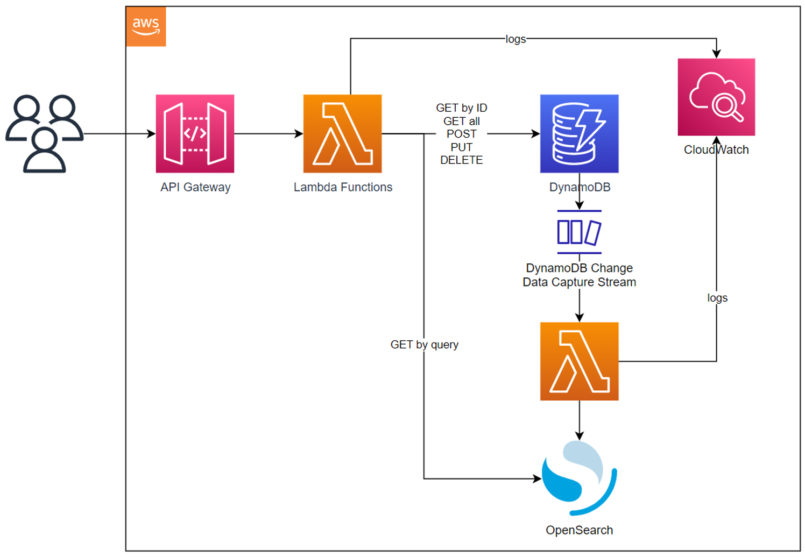

# Meadowlark 0.1.0

## Goals and Design

Overarching goals: basic feature parity with the ODS/API

**Source code: [https://github.com/Ed-Fi-Exchange-OSS/Meadowlark/tree/0.1.0](https://github.com/Ed-Fi-Exchange-OSS/Meadowlark/tree/0.1.0)**

| <br><br> Implemented | <br><br> Not Implemented |
| --- | --- |
| *​Data Model 3.1 and 3.3b<br>*   ... and easy to support others<br>*Ownership-based authorization<br>*   Validates authentication token<br>    *Authorizes client to access data that were written by the client ("ownership")<br>*   Optional foreign key enforcement<br>    *   With HTTP header, can disable foreign key validation | *​Authentication<br>*   oauth endpoint is fake, returning hard-coded tokens for demo purposes<br>*Cascading deletes<br>*   Extensions<br>*Composites<br>*   Profiles |

## Architecture



Some of the interesting challenges / learning opportunities with this architecture:

* Building a NoSQL structure and code– specifically, with DynamoDB – that supports the foreign key concept
* Rethinking authorization: simplifying by only adopting ownership-based authorization
* Right database for the job, using both DynamoDB and OpenSearch together

> [!INFO]
> The development team could just have easily picked Azure or Google Cloud. There was no reason to favor one platform over the other - the team just picked a platform and ran with it.

## Introduction

The initial goal of Meadowlark 0.1.0 was to achieve "API Parity" with the ODS/API: expose an API whose functionality matches that of the ODS/API to the extent that a client system would not know the difference.

That goal was not met. As the development team progressed through the project, it found that:

1. some of those existing API features may not have a place in a hypothetical future revision of the API, and
2. there were more interesting questions and topics to explore than strict API parity.

Consequently, the gaps in parity can be looked at from two perspective: purposeful divergence, and leftover (scope cut).

## Purposeful Divergence

### Authorization

When an API client connects to the ODS/API, which documents (records) are they allowed to access? The ODS/API has several authorization models, and they can get quite complex. Those models might truly be necessary. With Meadowlark, the team asked itself: what happens if we simplify - if you create it, you "own" it, and therefore you can access it? We call this "ownership authorization".

Does this mean that there can be two different documents for the same student? For better or worse, yes. Think of a SIS and an Assessment both creating Student documents, each with a distinct StudentUniqueId. Advantage: Assessment provider does not need to look up the SIS's StudentUniqueId. Disadvantage: what if they're already doing that?

This question of what authorization model(s) to support is one that the Alliance will need to continue refining with stakeholders. In the meantime, the Ownership Authorization sufficiently proves the point that Meadowlark *can* provide at least basic record-level authorization security.

### Composites

Aside from the Enrollments Composite, there has been little uptake of this ODS/API feature. The coding to reproduce this would be complex (as is the existing code), and there are likely other ways to achieve a similar goal for Enrollments.

### Overposting

The ODS/API allows submitting JSON payloads that have extra fields, not defined in the Data Standard. This was probably an undetected accident for a long period of time. Some API clients may in fact "break" if this feature is absent, because they have been sending unnecessary fields for a long time. Overposting [poses a small security risk](https://www.hanselman.com/blog/aspnet-overpostingmass-assignment-model-binding-security) and it is best to avoid supporting it.

### Links

The [API Specification](https://edfi.atlassian.net/wiki/display/EFDSRFC/Ed-Fi+RFC+16+-+Open+API+Spec) includes the concept of a "link", as shown in the following partial API response:

```json
 {
    "id": "229855ca5b28450592fffd886e232479",
    "schoolReference": {
      "schoolId": 255901107,
      "link": {
        "rel": "School",
        "href": "/ed-fi/schools/aa600640d35a418ea5bb51d32b148013"
      }
    },
...
}
```

The development team suspects that few, if any, clients are actually using these links to navigate between documents, and therefore deliberately chose to exclude them.

> [!WARNING]
> If Meadowlark were ever to evolve into a production-ready system, either it would need to add support for links, *or* the core API specification would have to evolve to drop the item.

## Leftovers

These *might* be addressed in a future where Meadowlark evolves toward a production-ready product. Or, they might move over to the Purposeful Divergence category.

### Profiles

Profiles help the API host to limit the data exposure to clients by restricting which *fields* are returned with a document. This feature is heavily used in some settings, and deserves another look - at the right time. The programming model would need to change substantially in order to replicate this functionality.

### Cascading Deletes

Delete an object, and it automatically deletes all references to as well. This is actually an "add-on" in the ODS/API that must be enabled manually. In Meadowlark, the coding would not be terribly difficult - but the effort does not support any specific research objective, and therefore it was left in the backlog as a low priority.

### Authentication

Ensuring that a client is whom they claim to be is absolutely necessary. Doing so in a proof-of-concept... not so critical. OAuth2 is a widely supported industry standard at this point. For Meadowlark 0.1.0, the ownership-based authorization relies on a JSON Web Token (JWT), which is "created" from the authentication process. That process, in 0.1.0, accepts either of two hard-coded sets of client credentials and creates a hard-coded JWT. In other words, it is completely fake and unreliable authentication, but it does allow the software to have real authorization.

If/when real authentication is brought in, it will likely use a third-party OAuth2 provider, unlike the ODS/API Suite 3.

### Open API Metadata

Generating Open API Metadata is an interesting topic in itself. With the Suite 3 technology, it comes out of the .NET-based code generation process. The development team is confident that it can create a plugin to generate this instead. For the 0.1.0 release, the metadata document from Suite 3 was saved as a JSON file, uploaded to cloud storage, and then imported into the Open API metadata HTTP handler at runtime as needed. This has the effect of making it *slightly* harder to add another data model to the Meadowlark code base. Well worth the sacrifice of scope.

### SchoolYear / SchoolYearTypes

A strange vestige of ODS/API Suite 2 crept into Suite 3: while most "Type" concepts were discarded, `SchoolYearType`  was kept in the API instead of `SchoolYear`. The development team had a good reason for this. Your humble article author has heard it but fails to remember the details. Thus it is that the [Core Student Data API specification](https://edfi.atlassian.net/wiki/display/EFDSRFC/Ed-Fi+RFC+16+-+Open+API+Spec) which defines a SchoolYearType, even though all entities that refer to it have a `SchoolYear`. Interestingly, neither is part of the Data Standard as a stand-alone entity.

### ETAGS

An ETAG is useful "extension" to the data model: a unique hash value that changes when a document changes. And it is likely desirable in a production-ready system, and would be easy to implement in Meadowlark. Example scenario timeline:

1. Client A gets a record from the API, with etag ABC
2. Client B also gets that record
3. Client A prepares an update to the record
4. Client B prepares an update to the record *and* issues a PUT request to the API, updating the record
5. Client A issues their PUT request, with the old etag. The API rejects it, as the etag changed at step 4.

## Demonstration

```shell
# Get code
git clone https://github.com/Ed-Fi-Exchange-OSS/Meadowlark
git checkout 0.1.0
cd Meadowlark
npm run install
cd Meadowlark-js

# Run locally
npm run init:local-dynamodb
pushd docker-Meadowlark
docker compose up -d
popd
npm run start:local

# In another terminal
npm run load-descriptors:local

# See test/http/local* for various requests to run in Visual Studio Code
```
