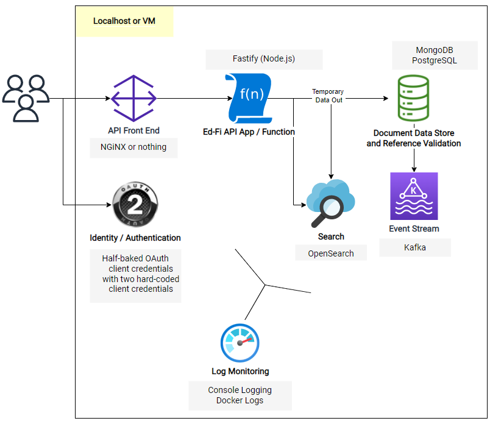

# Meadowlark 0.2.0

## Goals and Design

Replace DynamoDB

* [Meadowlark - MongoDB](../../project-meadowlark-exploring-next-generation-technologies/meadowlark-data-storage-design/meadowlark-mongodb.md)
* [Meadowlark - PostgreSQL](../../project-meadowlark-exploring-next-generation-technologies/meadowlark-data-storage-design/meadowlark-postgresql.md)
* [Meadowlark - Durable Change Data Capture](../../project-meadowlark-exploring-next-generation-technologies/meadowlark-streaming-and-downstream-data-stores/meadowlark-durable-change-data-capture.md)

Provide a full-access mode for authorization

* [Meadowlark 0.2.0 - Security](./meadowlark-020/meadowlark-020-security.md)

## Architecture



1. Runs on localhost!
2. New features / functionality:
    1. MongoDB transactional storage
    2. PostgreSQL transactional storage
    3. Node.js front end
    4. Data out from MongoDB to Kafka
3. Removing DynamoDB - see [Meadowlark - Referential Integrity in Document Databases](../../project-meadowlark-exploring-next-generation-technologies/meadowlark-data-storage-design/meadowlark-referential-integrity-in-document-databases.md) for more information.
4. Temporarily, AWS support is broken: we have not orchestrated a replacement for DynamoDB.

## Demonstration

Be sure to edit the `.env`  file as mentioned near the end of the following script:

```shell
# Get code
git clone https://github.com/Ed-Fi-Exchange-OSS/Meadowlark
git checkout 0.2.0
cd Meadowlark
npm install & npm run build

# Startup backend services
.eng/docker.ps1

# Run locally
pushd Meadowlark-js/services/meadowlark-fastify
cp .env.example .env    # And edit it appropriately
npm run start:local

# See test/http/local* for various requests to run in Visual Studio Code   
```
