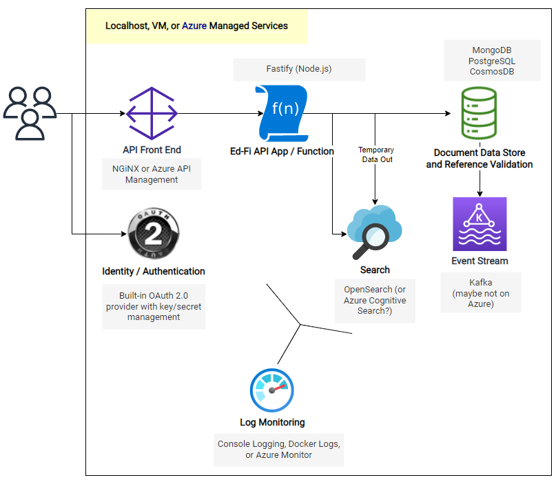

# Meadowlark 0.3.0

## Goals and Design

Low-frills installation for API support without breaking vendor integrations, suitable for pilot testing on Azure.

* [Multiple Data Standards](../meadowlark-api-design/meadowlark-multiple-data-standards.md) - 3.2.0-c for ODS/API 5.0 compatibility
* Flesh out the [Internal OAuth 2 Client Credential Provider](../meadowlark-security/meadowlark-authentication/meadowlark-internal-oauth-2-client-credential-provider.md)
* Script out Azure deployment - approach TBD: PowerShell / ARM, Kubernetes, Serverless?
* Standardize [Error Messages](../meadowlark-api-design/meadowlark-response-codes.md)
* [Log Monitoring](../meadowlark-operations/meadowlark-log-monitoring.md) with Azure Monitor?
* Performance testing

## Architecture

## Release

[https://github.com/Ed-Fi-Exchange-OSS/Meadowlark/releases/tag/v0.3.0](https://github.com/Ed-Fi-Exchange-OSS/Meadowlark/releases/tag/v0.3.0)

## Project Status

While not yet production-ready, we think this release is strong enough for some pilot testing with SIS vendors in the field, with the goal of finding out

* What is broken compared to the ODS/API release? There may be edge cases that we don't know about, or that we thought were unimportant.
* What do deployments look like? And what more should be built into the platform to support those deployments?

### What's Changed

* Real [OAuth2 authentication](https://github.com/Ed-Fi-Exchange-OSS/Meadowlark/blob/v0.3.0/docs/OAUTH2.md) (client credentials flow), using a built-in OAuth2 provider
* [Docker support](https://github.com/Ed-Fi-Exchange-OSS/Meadowlark/blob/v0.3.0/docs/DOCKER.md): `docker image pull edfialliance/meadowlark-ed-fi-api:v0.3.0`
* MongoDB and OpenSearch optimizations with respect to transactions and error handling
* OpenSearch: some of the querystring functionality is broken, and will be restored in an upcoming release
* Numerous bug fixes on API routes and payload validation
* Fastify clustering for multi-threaded operation
* Thorough documentation of [configuration options](https://github.com/Ed-Fi-Exchange-OSS/Meadowlark/blob/v0.3.0/docs/CONFIGURATION.md).
