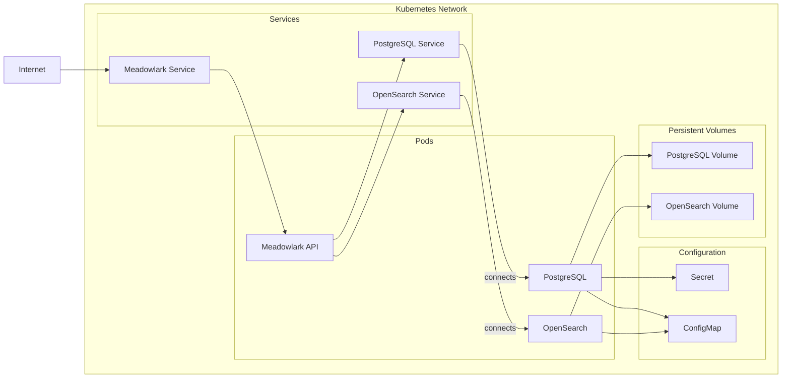

# Meadowlark Kubernetes Deployment

This folder provides a basic setup of a set of
[Kubernetes](https://kubernetes.io/) files to setup a cluster.

## Local Development

For local development, you need to use
[minikube](https://minikube.sigs.k8s.io/docs/start/).

* After installing, run `minikube start` to setup minikube in your local
  environment.
* Set the terminal in the */k8s* folder.
* Run `kubectl apply -f .` to apply all or go file by file (`kubectl apply -f {file-name}`).
* After done, inspect with `kubectl get pods`, and verify that all pods have
  status **RUNNING** (This can take a couple of minutes).

This will start the kubernetes infrastructure to run without exposing any
connection to the external network. When installing in a cloud provider the
clouds Load Balancing service will take care of making the connection to the
cluster, by opening a connection to the
[meadowlark-api-service](meadowlark-api-service.yaml).

This container has the type LoadBalancer, meaning that this is the entry point
for the load balancer provider.

To test this in the local environment, we need to open *tunnel* between the
local network and the Kubernetes cluster. To do so, run `minikube service
meadowlark-api --url`.

Copy the URL and connect to Meadowlark

> [!CAUTION]
> Current implementation is not able to connect to OpenSearch, this will be the next step.

### Kubernetes Architecture

